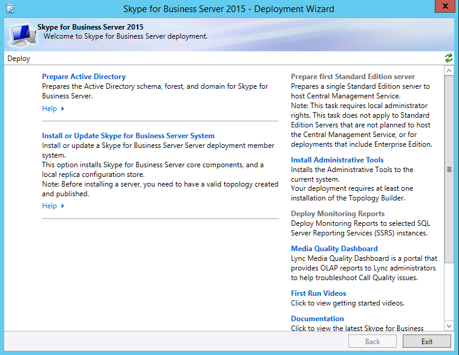

# Verwaltungstools in Skype for Business Server 2015 installieren
 
**Summary:** Learn how to install the administrative tools required for an installation of Skype for Business Server 2015. Download a free trial of Skype for Business Server 2015 from the Microsoft Evaluation center at: [https://www.microsoft.com/evalcenter/evaluate-skype-for-business-server](https://www.microsoft.com/evalcenter/evaluate-skype-for-business-server).
  
Zu den Verwaltungstools gehören der Topologie-Generator und die Systemsteuerung. The administrative tools must be installed on at least one server in the topology or a 64-bit management workstation running a Windows OS version that is supported for Skype for Business Server. Sie können die Schritte 1 bis 5 in einer beliebigen Reihenfolge ausführen. Die Schritte 6, 7 und 8 müssen jedoch wie in der Abbildung dargestellt nacheinander und nach den Schritten 1 bis 5 ausgeführt werden. Die Installation der Verwaltungstools wird in Schritt 3 beschrieben.
  

  
## Install Skype for Business Server 2015 administrative tools

The installation media for Skype for Business Server 2015 provides a flexible experience. When you first run Setup.exe, the only tools installed are the Skype for Business Server Deployment Wizard and the Skype for Business Server Management Shell. By using these two tools, known as Core Components, you can continue with the installation process, but they do not provide primary functionality for the overall Skype for Business Server environment. Der Bereitstellungs-Assistent wird nach Installation der Hauptkomponenten automatisch gestartet. The section of the Deployment Wizard titled **Install Administrative Tools** installs Skype for Business Server Topology Builder and Skype for Business Server Control Panel.
  
> [!IMPORTANT]
> Every Skype for Business Server environment must have at least one server with the administrative tools installed. 
  
Schauen Sie sich das Video mit den Schritten zum **Installieren von Verwaltungstools** an:
  
> [!video https://www.microsoft.com/en-us/videoplayer/embed/99a5c436-963b-4eed-b423-651568c87cb1?autoplay=false]
  
### Install Skype for Business Server 2015 administrative tools from the Deployment Wizard

1. Insert the Skype for Business Server 2015 installation media. Wenn das Setup nicht automatisch startet, doppelklicken Sie auf **Setup**.
    
2. Das Installationsmedium erfordert zur Ausführung Microsoft Visual C++. Es wird ein Dialogfeld angezeigt, in dem gefragt wird, ob Sie es installieren möchten. Klicken Sie auf **Ja**.
    
3. By using Smart Setup, a new feature in Skype for Business Server 2015, you can connect to the Internet to check for updates during the installation process. Dies ist benutzerfreundlicher, da sichergestellt wird, dass Sie bei der Installation die aktuellen Updates zur Verfügung haben. Klicken Sie auf **Installieren**, um mit der Installation zu beginnen.
    
4. Lesen Sie die Lizenzbedingungen sorgfältig durch und klicken Sie auf **Ich stimme den Lizenzbedingungen zu**, wenn Sie diesen zustimmen. Klicken Sie dann auf **OK**.
    
5. The Skype for Business Server 2015 Core Components will be installed on the server. 
    
    Die Hauptkomponenten werden in der Abbildung gezeigt.
    
    
  
  - **Skype for Business Server 2015 Deployment Wizard** A deployment program that provides a launch pad for installing the various components of Skype for Business Server 2015.
    
  - **Skype for Business Server 2015 Management Shell** A preconfigured PowerShell program that allows for administration of Skype for Business Server 2015.
    
    Once the installation of the Core Components is complete, the Skype for Business Server 2015 Deployment Wizard will automatically launch, as shown in the figure. 
    
    
  
6. In addition to the Core Components, you will also need to install Skype for Business Server 2015 Topology Builder and Skype for Business Server 2015 Control Panel on at least one server in the environment. Klicken Sie im Bereitstellungs-Assistenten auf **Verwaltungstools installieren**.
    
7. Klicken Sie auf **Weiter**, um den Installationsvorgang zu starten.
    
8. Wenn die Installation abgeschlossen ist, klicken Sie auf **Fertig stellen**. Die Verwaltungstools wurden nun dem Server hinzugefügt (siehe Abbildung).
    
    
  
   - **Skype for Business Server 2015 Topology Builder** A program used to build, deploy, and manage topologies.
    
   - **Skype for Business Server 2015 Control Panel** A program used to administer the installation.
    

