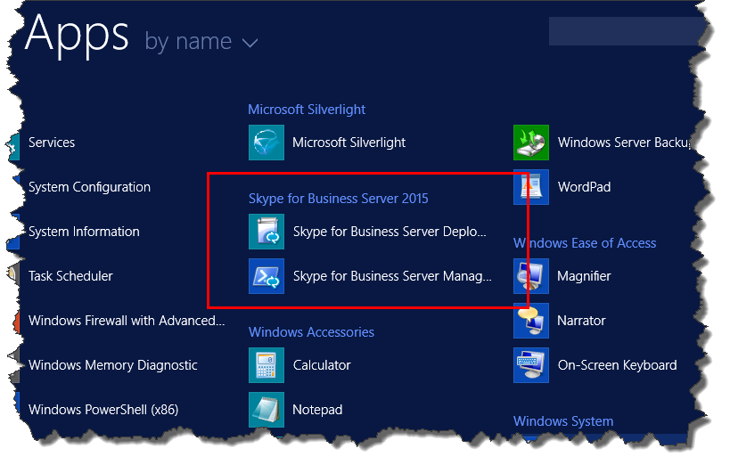

# Installieren der Verwaltungstools in Skype für Business Server
 
**Zusammenfassung:** Informationen Sie zum Installieren der erforderlichen für eine Installation von Skype für Business Server administrative Tools. Laden Sie eine kostenlose Testversion von Skype für Business Server aus dem Microsoft Evaluation Center herunter: [https://www.microsoft.com/evalcenter/evaluate-skype-for-business-server](https://www.microsoft.com/evalcenter/evaluate-skype-for-business-server).
  
Zu den Verwaltungstools gehören der Topologie-Generator und die Systemsteuerung. Auf mindestens einem Server in der Topologie oder einem 64-Bit-Verwaltungscomputer auf dem eine Windows-Betriebssystem-Version, die für Skype für Business Server unterstützt wird, müssen die Verwaltungstools installiert werden. Sie können die Schritte 1 bis 5 in einer beliebigen Reihenfolge ausführen. Die Schritte 6, 7 und 8 müssen jedoch wie in der Abbildung dargestellt nacheinander und nach den Schritten 1 bis 5 ausgeführt werden. Die Installation der Verwaltungstools wird in Schritt 3 beschrieben.
  

  
## Skype für Business Server-Verwaltungstools installieren

Das Installationsmedium für Skype für Business Server bietet flexible. Beim Ausführen von Setup.exe sind die einzigen Tools installiert die Skype für Business Server-Bereitstellungs-Assistenten und den Skype für Business Server-Verwaltungsshell. Mithilfe dieser zwei Tools, bezeichnet als Hauptkomponenten, können Sie den Installationsvorgang fortsetzen, aber sie bieten keine primäre Funktionalität für die allgemeine Skype für Business Server-Umgebung. Der Bereitstellungs-Assistent wird nach Installation der Hauptkomponenten automatisch gestartet. Im Abschnitt des Bereitstellungs-Assistenten mit dem Titel **Verwaltungstools installieren** installiert Skype für Business Server-Topologie-Generator und Skype Business Server-Systemsteuerung.
  
> [!IMPORTANT]
> Jeder Skype für Business Server-Umgebung benötigen Sie mindestens einen Server mit die Verwaltungstools installiert sind. 
  
Schauen Sie sich das Video mit den Schritten zum **Installieren von Verwaltungstools** an:
  
> [!video https://www.microsoft.com/en-us/videoplayer/embed/99a5c436-963b-4eed-b423-651568c87cb1?autoplay=false]
  
### Installieren Sie Skype für Business Server-Verwaltungstools aus den Bereitstellungs-Assistenten

1. Legen Sie die Skype für Business Server-Installationsmedien. Wenn das Setup nicht automatisch startet, doppelklicken Sie auf **Setup**.
    
2. Das Installationsmedium erfordert zur Ausführung Microsoft Visual C++. Es wird ein Dialogfeld angezeigt, in dem gefragt wird, ob Sie es installieren möchten. Klicken Sie auf **Ja**.
    
3. Mithilfe der Smart-Setup ein neues Feature in Skype für Business Server können Sie mit dem Internet während der Installation nach Updates suchen verbinden. Dies ist benutzerfreundlicher, da sichergestellt wird, dass Sie bei der Installation die aktuellen Updates zur Verfügung haben. Klicken Sie auf **Installieren**, um mit der Installation zu beginnen.
    
4. Lesen Sie die Lizenzbedingungen sorgfältig durch und klicken Sie auf **Ich stimme den Lizenzbedingungen zu**, wenn Sie diesen zustimmen. Klicken Sie dann auf **OK**.
    
5. Die Skype für Business Server Core-Komponenten wird auf dem Server installiert. 
    
    Die Hauptkomponenten werden in der Abbildung gezeigt.
    
    
  
  - **Skype für Business Server-Bereitstellungs-Assistenten** Eine Bereitstellung-Programm, das ein Launch Pad enthält, für die verschiedenen Komponenten von Skype für Business Server installieren.
    
  - **Skype für Business Server-Verwaltungsshell** Eine vorkonfigurierte PowerShell-Programm, das für die Verwaltung von Skype für Business Server ermöglicht.
    
    Nach Abschluss die Installation der Kernkomponenten wird die Skype für Business Server Installations-Assistent automatisch gestartet, wie in der Abbildung dargestellt. 
    
    
  
6. Zusätzlich zu den Hauptkomponenten müssen Sie auch Skype für Business Server-Topologie-Generator und Skype Business Server-Systemsteuerung auf mindestens einem Server in der Umgebung zu installieren. Klicken Sie im Bereitstellungs-Assistenten auf **Verwaltungstools installieren**.
    
7. Klicken Sie auf **Weiter**, um den Installationsvorgang zu starten.
    
8. Wenn die Installation abgeschlossen ist, klicken Sie auf **Fertig stellen**. Die Verwaltungstools wurden nun dem Server hinzugefügt (siehe Abbildung).
    
    
  
   - **Skype für Business Server-Topologie-Generator** Ein Programm, das zum Erstellen, bereitstellen und Verwalten von Topologien verwendet.
    
   - **Skype für Business Server-Systemsteuerung** Ein Programm verwendet, um die Installation zu verwalten.
    

