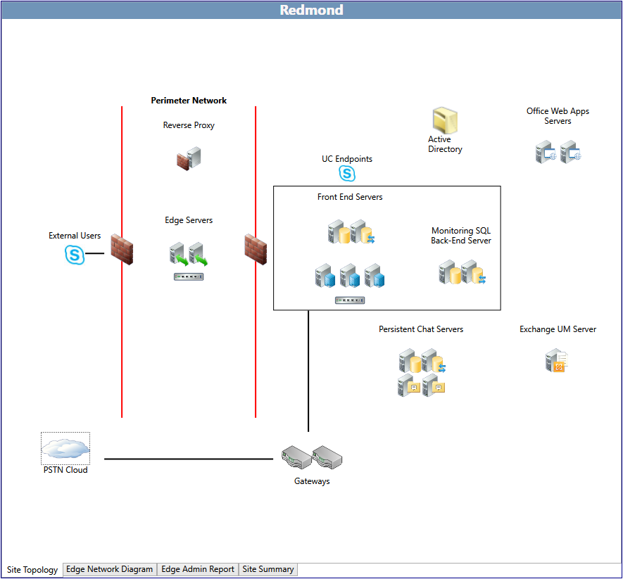

# Edit the topology in Skype for Business Server 2015

Nach Beantwortung der anfänglichen Fragen können Sie den vollqualifizierten Domänennamen (Fully Qualified Domain Name, FQDN) und die IP-Adressen der Website bearbeiten. Machen Sie hierzu auf der Seite **Globale Topologie** einen Doppelklick auf den Standort, den Sie bearbeiten möchten.

Das Planungstool zeigt die Standorttopologie für den ausgewählten Standort. Im unteren Bereich der Seite für den Standort werden vier Registerkarten angezeigt:

- Standorttopologie - die aktuell angezeigte Seite mit einer optischen Übersicht der empfohlenen Topologie.

- Edge-Netzwerkdiagramm - Edge-Netzwerkdiagramm Seite ist, in dem der Designer die meisten Aufgaben im Planungstool wird. Das Diagramm zeigt die Netzwerkkonfiguration für einen empfohlenen Skype für Business Server 2015 Topologie, mit bearbeitbaren Einträge für IP-Adressen und FQDNs für Server, Pool, und sowohl Hardware und Domain Name System (DNS) Lastenausgleich.

- Edgeverwaltungsbericht – der Edgeverwaltungsbericht insgesamt vier Berichte enthält:

     

  - Zusammenfassungsbericht - Bericht für allgemeine Einstellungen für die Edge-Netzwerkkonfiguration. Wenn Sie auf der Seite **Edge-Netzwerkdiagramm** die TCP-IP- und FQDN-Werte der Topologie in die der tatsächlichen Bereitstellung ändern, werden diese Adressen und Namen hier dargestellt. Andernfalls wird hier der Standardtext angezeigt.

  - Zertifikatbericht – der zertifikatbericht führt den Antragstellernamen und alternative Antragstellernamen für Zertifikate, die für die Topologie erforderlich sind.

  - Firewallbericht - firewallbericht werden die notwendigen Informationen zum Konfigurieren von Firewalls Umkreisnetzwerk in der Infrastruktur aufgelistet. Diese umfassen die IP-Adressen (entweder die Standardwerte oder die bearbeiteten Werte), Serverrolle, Quell-IP und Port, Ziel-IP und Port, Transportprotokoll, Anwendungsprotokoll und relevante Hinweise.

  - DNS-Bericht - DNS-Bericht listet relevanten Informationen für die DNS-Einträge, die Sie erstellen müssen. Hierzu zählen Eintragstyp, FQDN, IP-Adresse und Hinweise zum ordnungsgemäßen Betrieb.

- Siteübersicht - der Siteübersicht liefert eine Übersicht über die Elemente, die Sie durch die anfänglichen Interview Fragen beantworten oder die Werte in den **Entwurf von Standorten**ausfüllen vorgenommen haben. Es werden auch Kapazitätsinformationen angezeigt.

    > [!NOTE]
    > Die Informationen auf der Seite mit der Standortzusammenfassung sind auf den jeweiligen Entwurf zugeschnitten und enthält möglicherweise nicht alle Abschnitte oder Informationen, die hier besprochen werden.

## Bearbeiten des Netzwerkkonfigurationsdiagramms

Die meisten Aufgaben, die ein Designer in der Skype für Business Server 2015 Planungstool umfasst das definieren die Einträge für die IP-Adressen und den vollqualifizierten Domänennamen (FQDNs) für die Einträge im Netzplandiagramm. In den Berichten und andere Informationen in das Planungstool übertragenen Informationen, die auf dieser Seite eingegeben wird.

Das Planungstool erstellt ein Netzwerkdiagramm mit Standardtext für IP-Adressen und FQDNs.

So bearbeiten Sie das Netzwerkdiagramm und geben Werte ein

1. Wählen Sie einen Abschnitt des Netzwerks aus, den Sie zuerst bearbeiten möchten. Machen Sie z. B. einen Doppelklick auf den Text **access1.contoso.net**. Geben Sie im nun geöffneten Dialogfeld den tatsächlichen FQDN für den Server „access1.contoso.net“ ein und ersetzen Sie die IP-Adresse 131.107.155.3 durch die tatsächliche IP-Adresse.

2. Klicken Sie auf **OK**, um die Einträge zu speichern.

3. Fahren Sie mit der Bearbeitung von IP-Adressen und FQDNs fort, und geben Sie virtuelle IP-Adressen für Hardwaregeräte zum Lastenausgleich oder Servereinträge für einen DNS-Lastenausgleich (Domain Name System) für Server in Pools an.

Eine nützliche Funktion des Planungstools ist die, dass ein Bereich von IP-Adressen und Serverhostnamen inkrementell zugewiesen werden kann. Auf diese Weise muss der für den Entwurf verantwortliche Benutzer die Server in einem Pool nicht einzeln bearbeiten. Beispiel:

1. Machen Sie einen Doppelklick auf die Front-End-Server im Pool. Wählen Sie im nun geöffneten Dialogfeld die Option **Möchten Sie IP-Adressen und FQDN als Startpunkte für alle äquivalenten Server im Cluster verwenden?**.

2. Beispielsweise lautet der Startwert für den ersten Server "fe0101.contoso.net", und die IP-Adresse ist auf "192.168.21.222" festgelegt.

3. Geben Sie in FQDN des Front-End-Servers den Wert **fe0.contoso.com** und in **IP-Adresse des Front-End-Servers** die Adresse 192.168.21.131 ein und klicken Sie anschließend auf **OK**.

4. Die Funktion zur automatischen inkrementellen Erhöhung aktualisiert alle Server im Pool von "fe01" bis "fe06" und alle IP-Adressen von 192.168.21.131 bis 136.

Nachdem Sie die Bearbeitung abgeschlossen haben, speichern Sie die Topologie, indem Sie folgende Schritte ausführen:

Um das Planungstool Design zu speichern, klicken Sie auf **Datei**und dann auf **Topologie speichern** oder **Topologie speichern unter**. Falls ein Dialogfeld **Planungstool speichern unter** angezeigt wird, geben Sie in **Dateiname** einen Namen für die Datei ein und klicken Sie auf **Speichern**.

## Siehe auch

[Editing the Design](https://technet.microsoft.com/library/08f639ba-0e5f-4ae7-9191-c3d96c25b169.aspx)
