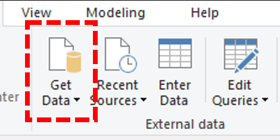
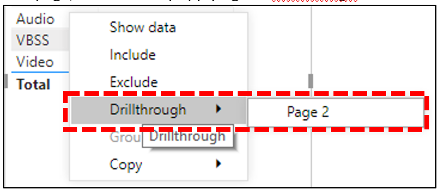

# Installieren von Power BI Connector zur Verwendung von CQD-Abfragevorlagen

Bevor Sie die Power BI-Abfragevorlagen für CQD (PBIX-Dateien) verwenden können, müssen Sie den Power BI-Connector für Microsoft CQD mit der im [Download](https://github.com/MicrosoftDocs/OfficeDocs-SkypeForBusiness/blob/live/Teams/downloads/CQD-Power-BI-query-templates.zip?raw=true)enthaltenen Datei *MicrosoftCallQuality. PQx* installieren. 

Lesen [verwenden Sie Power BI zum Analysieren von CQD-Daten für Teams](CQD-Power-BI-query-templates.md) , um mehr über diese Vorlagen zu erfahren.

## Installation

Der Vorgang zum Installieren eines benutzerdefinierten Connectors und zum Anpassen der Sicherheit, um die Verwendung des Connectors zu ermöglichen, wird in der [Power BI-Dokumentation](https://docs.microsoft.com/power-bi/desktop-connector-extensibility)ausführlich beschrieben. Aus Gründen der Einfachheit ist hier eine kurze Erläuterung zu finden:

1.  Überprüfen Sie, ob Ihr Computer bereits über einen * \[Ordner mit Power BI-benutzerdefinierten Dokumenten\]\\für Power BI-Desktops\\*verfügt. Wenn dies nicht der Fall ist, erstellen Sie diesen Ordner. 1

2.  Laden Sie die connectordatei (eine * \*MEZ* -oder * \*PQx* -Datei) herunter, und legen Sie Sie im Verzeichnis *benutzerdefinierte Connectors* ab.

3.  **Wenn es sich bei der connectordatei um eine * \*MEZ* -Datei handelt,** müssen Sie auch Ihre Sicherheitseinstellungen anpassen, wie in der [benutzerdefinierten Connector-Setup-Dokumentation](https://docs.microsoft.com/power-bi/desktop-connector-extensibility#data-extension-security)beschrieben.

Wenn eine neue Version dieses Power BI Connectors für Microsoft Teams veröffentlicht wird, ersetzen Sie einfach die alte connectordatei im Verzeichnis *benutzerdefinierte* Connectors durch die neue Datei.

## Installationsanforderungen

Um einen Bericht zu erstellen und Abfragen auszuführen, müssen Sie zuerst eine Verbindung mit der CQD-Datenquelle herstellen. Führen Sie die folgenden Schritte aus, um eine Verbindung herzustellen:

1.  Klicken Sie auf der Registerkarte Start des Power BI-Desktops auf *Daten abrufen*.

    

2.  Das Fenster " *Daten abrufen* " sollte an dieser Stelle angezeigt werden. Navigieren Sie zu *Online Diensten*, wählen Sie dann *Microsoft-Anrufqualität (Beta)* und klicken Sie auf *verbinden*.

    

3.  Sie werden zur nächsten Anmeldung aufgefordert. Verwenden Sie die gleichen Anmeldeinformationen, die Sie für CQD verwenden. 2

4.  Die nächste Aufforderung gibt Ihnen die Möglichkeit zwischen zwei *Daten Verbindungsmodi*. Wählen Sie *DirectQuery* und klicken Sie auf *OK*.

5.  Schließlich erhalten Sie eine abschließende Aufforderung, in der das gesamte Datenmodell für CQD angezeigt wird. An diesem Punkt werden keine Daten angezeigt, nur das Datenmodell für CQD. Wählen Sie *Laden* aus, um den Setupvorgang abzuschließen.

6.  An diesem Punkt lädt Power BI das Datenmodell auf die Rechte Seite des Fensters. Die Seite bleibt ansonsten leer, und standardmäßig werden keine Abfragen geladen. Führen Sie die folgenden Schritte zum Erstellen von **Abfragen** aus, um eine Abfrage zu erstellen und Daten zurückzugeben.

Wenn einer der Schritte während des Setupvorgangs nicht ganz klar war, finden Sie [hier](https://docs.microsoft.com/power-bi/desktop-quickstart-connect-to-data)eine detailliertere Erläuterung des Prozesses.

## Erstellen von Abfragen

Nachdem die Einrichtung abgeschlossen ist, sollten Sie die Namen von mehreren hundert Dimensionen sehen und die Last im *Feld* Bereich misst. Das Erstellen von tatsächlichen Abfragen von hier aus ist einfach, wählen Sie einfach die Dimensionen und Measures aus, die Sie für Ihre Abfrage wünschen, und ziehen Sie Sie dann auf die Seite. Nachfolgend finden Sie eine ausführlichere Erläuterung mit einem einfachen Beispiel:

1.  Wählen Sie die Visualisierung aus, die Sie verwenden möchten, im Bereich *Visualisierungen* . Auf der Seite sollte eine leere Version dieser Visualisierung angezeigt werden. In diesem Beispiel wird die *Tabellen* Visualisierung verwendet.

    

2.  Ermitteln Sie, welche Dimensionen und Measures (gekennzeichnet durch ein Aggregations Symbol mit dem Namen) Sie für Ihre Abfrage verwenden möchten, wählen Sie Sie manuell aus, und ziehen Sie Sie auf die schwarze Visualisierung. Ziehen Sie Sie alternativ in das Feld *Werte* unterhalb der Visualisierungsoptionen.

    

    > [!IMPORTANT] 
    > Das Dashboard für die Anrufqualität erfordert ein Maß für die Ausführung einer Abfrage. Fehler beim Hinzufügen eines Measures zu einer Abfrage führen dazu, dass die Abfrage fehlschlägt.

3.  Wählen Sie als nächstes alle Dimensionen aus, nach denen Sie filtern möchten, und ziehen Sie Sie in das Feld *Filter für dieses visuelle* Element im Bereich *Filter* . Der CQD Power BI-Connector unterstützt derzeit die *grundlegende Filterung* (Auswählen von Werten aus einer Liste möglicher Dimensionswerte), *Erweiterte Filterung* (Manuelles angeben von Werten und Operanden zum Filtern auf, ähnlich wie bei erweiterten CQD) und *relative Datumsfilterung* (nur verfügbar für die Dimensionen *Endzeit* und *Anfangszeit* ). Das Filtern nach *Top N* wird von CQD nicht unterstützt.

    

4.  Wählen Sie schließlich im Bereich *Visualisierungen* die Registerkarte *Format* aus, um Ihre Abfrage zu formatieren und zu formatieren.

    > [!NOTE]
    > Für CQD-Abfragen ist mindestens ein Measure erforderlich, damit Sie ausgeführt werden können. Wenn Ihre Abfrage nicht geladen wird, überprüfen Sie, ob Sie ein Measure in die Abfrage aufgenommen haben.

## Erstellen eines Drillthrough-Berichts

Mit [Drillthrough in Power BI](https://docs.microsoft.com/power-bi/desktop-drillthrough) können Sie fokussierte Berichte erstellen, die Sie mithilfe der Werte anderer Berichte als Kontext schnell filtern können. Wenn Sie wissen, wie Sie Ihre erste Abfrage mit dem CQD-Konnektor erstellen, ist das Erstellen eines Drillthroughs noch einfacher.

1.  Erstellen Sie eine weitere Seite für den fokussierten Bericht, und fügen Sie dann Ihre Abfragen zu dieser Seite hinzu.

2.  Wählen Sie die Dimension aus, die Sie als Drillthroughfilter verwenden möchten, und ziehen Sie Sie auf das Feld *Drillthrough* unter im Bereich *Visualisierungen* .

    

3.  **Das wars\!** Jede andere Abfrage auf einer anderen Seite, die diese Dimension verwendet, kann nun auf diese Seite einen Drillthrough durchsetzen, wobei der Wert der Drillthrough-Dimension automatisch als Filter angewendet wird.

    

Im Gegensatz zu erweiterten CQD unterstützt Power BI nicht sequenziellen Drillthrough. Solange eine Abfrage die erforderliche Dimension enthält, kann Sie Drillthrough zu jeder anderen Seite vornehmen.

### Bewährte Methode

Connector-Abfragen für die Anrufqualität sollten im Hinblick auf Drillthroughfunktionen entworfen werden. Anstatt zu versuchen, alle Daten gleichzeitig zu laden und dann mit Filtern zu verkleinern, beginnen Sie mit breiteren Abfragen mit niedriger Kardinalität, und führen Sie einen Drilldown zu Abfragen mit hoher Kardinalität durch. Wenn Sie beispielsweise versuchen zu diagnostizieren, welche Subnetze am meisten zu Qualitätsproblemen beitragen, ist es hilfreich, zunächst die Regionen und Länder zu identifizieren, die zu dem Problem beitragen, und dann einen Drilldown zu den Subnetzen in dieser Region oder in diesem Land durchführen. Die Verbindungs Vorlagen für die Anrufqualität wurden auf diese Weise entworfen, um als Beispiel zu fungieren.

## Einschränkungen

Trotz der Nutzung von Power BI wird nicht alle Power BI-Funktionen vom CQD-Connector unterstützt, und zwar aufgrund von Einschränkungen für CQD-Datenmodell oder für DirectQuery-Connectors im Allgemeinen. In der folgenden Liste sind einige der bemerkenswerten Einschränkungen des Verbinders aufgeführt, die jedoch nicht als erschöpfend gelten sollten:

1.  **Berechnete Spalten –** DirectQuery-Connectors haben in der Regel nur begrenzte Unterstützung für berechnete Spalten in Power BI. Während einige berechnete Spalten möglicherweise mit dem Verbinder funktionieren, sollten diese Ausnahmen berücksichtigt werden. In der Regel funktionieren berechnete Spalten nicht.

2.  **Aggregationen –** Das CQD-Datenmodell basiert auf einem Cube-Modell, was bedeutet, dass Aggregationen bereits in Form von Measures unterstützt werden. Der Versuch, Aggregationen manuell zu verschiedenen Dimensionen hinzuzufügen oder den Aggregations eines Measures zu ändern, funktioniert nicht mit dem Verbinder, und es wird in der Regel zu einem Fehler führen.

3.  **Benutzerdefinierte visuelle Elemente –** Obwohl der CQD-Connector mit einer Reihe von benutzerdefinierten visuellen Elementen funktioniert, können wir die Kompatibilität mit allen benutzerdefinierten visuellen Elementen nicht garantieren. Viele benutzerdefinierte visuelle Elemente Vertrauen auf die Verwendung berechneter Spalten oder importierter Daten, die von DirectQuery-Konnektoren nicht unterstützt werden.

4.  **Verweisen auf zwischengespeicherte Daten –** Power BI unterstützt derzeit keine Verweise auf zwischengespeicherte Daten von einem DirectQuery-Connector in irgendeiner Weise. Jeder Versuch, auf die Ergebnisse einer Abfrage zu verweisen, führt zu einer neuen Abfrage. 

5.  **Relative Datenfilterung –** Wird im CQD-Connector unterstützt, jedoch nur mit den Dimensionen *Startzeit* und *Endzeit* . Obwohl die *Date* -Dimension möglicherweise die offensichtliche Wahl für die relative Datumsfilterung ist, wird *Datum* nicht als Datum-Uhrzeit-Objekt gespeichert und unterstützt daher keine relative Datumsfilterung in Power BI.

Beachten Sie, dass sich diese Einschränkungen mit der endgültigen Version des Connectors wahrscheinlich nicht ändern, obwohl sich der Connector in der Vorschau befindet. Bei den meisten dieser Probleme handelt es sich entweder um Einschränkungen des DirectQuery-Connector-Designs in Power BI oder um ein grundlegendes Design des CQD-Datenmodells.

## Problembehandlung

### Ich versuche, die Datumsspalte als Datumsdaten Schnitt zu verwenden. Sobald ich den Datentyp dieser Spalte bis dato konvertiere, erhalte ich folgende Fehlermeldung:

> **Die Daten für dieses Visual konnten nicht geladen**werden: OLE DB-oder ODBC-Fehler: [Ausdruck. Fehler] der Ausdruck konnte nicht in die Datenquelle gefaltet werden. Versuchen Sie es mit einem einfacheren Ausdruck. 

Datumsdaten Schnitte werden vom Power BI-Connector nicht unterstützt. Wenn Sie einen Datumsbereich angeben möchten, wenden Sie zwei Filter auf den Bericht an, indem Sie einen Wert kleiner als und größer als Datum angeben.

Wenn die Datumsangaben, die Sie anzeigen möchten, aktuell sind, verwenden Sie alternativ einen relativen Datumsfilter, um nur Daten für die letzten N Tage/Wochen/Monate anzuzeigen.

## Fehler Codes

Da der CQD Power BI-Connector in Bezug auf Arten von Abfragen, die Sie erstellen können, weniger eingeschränkt als die Browser-APP ist, treten möglicherweise beim Erstellen von Abfragen gelegentlich verschiedene Fehler auf. Für den Fall, dass eine Fehlermeldung vom Typ "CQDError" angezeigt wird. RunQuery – Abfrageausführungsfehler ", verweisen Sie auf die nachstehende Liste mit der Fehlertyp-Nummer, die zur Behandlung des möglichen Problems mit der Abfrage bereitgestellt wurde. Im folgenden finden Sie die am häufigsten verwendeten Fehlertypen Codes, die mit dem CQD Power BI-Connector auftreten können:

  - **ErrorType 1 – Abfrage Strukturfehler:** Ein Abfrage Strukturfehler wird in der Regel dadurch verursacht, dass der Connector keine ordnungsgemäß formatierte Abfrage erstellt. Dies geschieht am häufigsten bei Verwendung nicht unterstützter Funktionen, wie in den oben genannten Einschränkungen angegeben. Überprüfen Sie, ob Sie keine berechneten Spalten oder benutzerdefinierte visuelle Elemente für diese Abfrage verwenden.

  - **ErrorType 2 – Fehler beim Erstellen einer Abfrage:** Ein Fehler beim Erstellen einer Abfrage wird dadurch verursacht, dass der CQD-Connector die Abfrage, die Sie erstellen möchten, nicht ordnungsgemäß analysieren kann. Dies geschieht am häufigsten bei Verwendung nicht unterstützter Funktionen, wie in den oben genannten Einschränkungen angegeben. Überprüfen Sie, ob Sie keine berechneten Spalten oder benutzerdefinierte visuelle Elemente für diese Abfrage verwenden.

  - **ErrorType 5 – Ausführungs Timeout:** Die Abfrage hat die maximal mögliche Laufzeit erreicht, bevor ein Timeout eintritt. Versuchen Sie, der Abfrage weitere Filter hinzuzufügen, um deren Bereich zu begrenzen. Das Einschränken des Datenbereichs ist oft die effektivste Methode, um dies zu erreichen.

  - **ErrorType 7 – kein Messfehler:** Für CQD-Abfragen ist ein Measure erforderlich, um zu funktionieren. Überprüfen Sie, ob Ihre Abfrage Measure enthält. Measures im CQD-Verbinder werden durch das Aggregations Symbol (Summe) vor dem Namen gekennzeichnet.

Wenn weitere Fehler außerhalb dieses Bereichs auftreten, Benachrichtigen Sie das CQD-Team, damit wir Ihnen bei der Problembehandlung helfen und die Dokumentation gegebenenfalls aktualisieren können.

## Fußnoten

**1** bestimmte Prozesse und Apps (z. b. OneDrive) können dazu führen, dass der Stammordner Ihres Dokuments geändert wird. Stellen Sie sicher, dass das *Power\\BI-Desktop benutzerdefinierte Connectors* -Verzeichnis innerhalb des aktuellen Ordners für Stammordner Dokumente gespeichert ist.

**2** die Anmeldeinformationen, die Sie für CQD verwenden, müssen *nicht* dieselben Anmeldeinformationen sein, die Sie für die Anmeldung bei der Power BI-Desktop Anwendung verwenden.

## Häufig gestellte Fragen

### Wann wird der Power BI-Connector über den Status "Beta" aktualisiert?

Trotz des Beta-Tags ist der Connector für die Anrufqualität für Power BI die Veröffentlichungsversion des Connectors und wurde offiziell vom Power BI-Team signiert, um dies zu widerspiegeln. Das Zertifizierungsverfahren zum Entfernen dieses Beta-Tags ist umfangreich und erfordert eine Verpflichtung des Power BI-Teams, den Connector auch direkt zu unterstützen. Aus Zeitgründen ist das Power BI-Team derzeit nicht in der Lage, diese Unterstützung und umfassendere Zertifizierung bereitzustellen, ist aber weiterhin bereit, die Sicherheit, Authentizität und allgemeine Funktionalität des Microsoft Call Quality Connectors zu bezeugen.

## Verwandte Themen

[Verwenden von Power BI zum Analysieren von CQD-Daten für Teams](CQD-Power-BI-query-templates.md)
