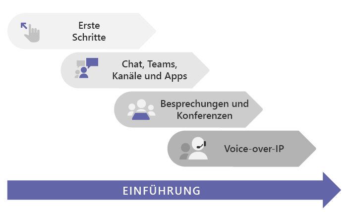

# Bereitstellen von Microsoft TeamsHow to roll out Microsoft Teams

## Hier geht’s losStart here
Gleich, ob Sie ein kleines Unternehmen oder ein multinationaler Konzern sind, der Ort für den Einstieg in die Bereitstellung von Teams ist [Erste Schritte](get-started-with-teams-quick-start.md).Whether you're a small business or a multi-national enterprise, the place to start for rolling out Teams is [Get started](get-started-with-teams-quick-start.md). Es führt Sie durch eine Teams-Bereitstellung im kleinen Maßstab, was möglicherweise für ein kleines Unternehmen schon völlig ausreichend ist.It walks you through a small-scale Teams rollout, which may be all you need if you're a small business. Wenn Sie einer größeren Organisation angehören, verwenden Sie [Erste Schritte](get-started-with-teams-quick-start.md) für die Pilotbereitstellung von Teams mit einer kleinen Gruppe von Early Adoptern, damit Sie Teams kennenlernen und mit der Planung Ihrer organisationsweiten Bereitstellung beginnen können.If you're a larger organization, use [Get started](get-started-with-teams-quick-start.md) to pilot Teams with a small group of early adopters so you can learn about Teams and start planning your org-wide deployment. 

## Empfohlene Wege zu Microsoft TeamsRecommended path to Teams

Wir empfehlen eine phasenweise Bereitstellung von Teams, Workload nach Workload in dem Maß, wie Ihre Organisation dazu bereit ist.We recommend rolling out Teams in stages, workload by workload, as your organization is ready. **Sie brauchen nicht bis zum Abschluss eines Schritts zu warten, bevor Sie mit dem nächsten beginnen.****You don’t have to wait until you've completed one step before you move to the next.** Manche Organisationen ziehen möglicherweise die Bereitstellung aller Funktionen von Teams vor, während andere einen phasenweisen Ansatz bevorzugen.Some orgs may want to roll out all Teams features at once, while others may prefer a phased approach. Hier finden Sie die Teams-Workloads in der Reihenfolge, die wir zur Bereitstellung empfehlen:Here are the Teams workloads, in the order we recommend rolling them out:

- [Erste SchritteGet started](get-started-with-teams-quick-start.md)
- [Chat, Teams, Kanäle und AppsChat, teams, channels, & apps](deploy-chat-teams-channels-microsoft-teams-landing-page.md)
- [Besprechungen und KonferenzenMeetings & conferencing](deploy-meetings-microsoft-teams-landing-page.md)
- [Cloud VoiceCloud voice](cloud-voice-landing-page.md)

[Einführungshub](adopt-microsoft-teams-landing-page.md): Achten Sie im gesamten Verlauf Ihrer Teams-Bereitstellung unbedingt darauf, diese Ressourcen zu nutzen, um die Einführung von Teams zu fördern.[Adoption hub](adopt-microsoft-teams-landing-page.md): Throughout your Teams rollout, be sure to take advantage of these resources to help drive Teams adoption.

## Wenn Sie von Skype for Business-, lokalen oder Hybridbereitstellungen ausgehenIf you're starting from Skype for Business, on-premises, or hybrid deployments

Wenn Sie von Skype for Business (online oder lokal) zu Teams kommen oder eine Hybridkonfiguration benötigen, sollten Sie trotzdem dem oben dargestellten [empfohlenen Weg](#recommended-path-to-teams) für die Bereitstellung von Teams folgen, aber zunächst müssen Sie etwas zusätzliche Planung hinter sich bringen.If you're coming to Teams from Skype for Business (online or on premises), or if you need a hybrid configuration, you still want to follow the [recommended path](#recommended-path-to-teams) above for rolling out Teams, but first you need to do some extra planning. Überprüfen Sie als erstes die Anleitung in der Tabelle unten, die sich auf das Profil Ihrer Organisation bezieht.Start by reviewing the guidance in the table below that applies to your organization's profile.

|  |Profil Ihrer OrganisationYour organization's profile|AnleitungGuidance  |
|---------|---------|---------|
||Ich verwende zurzeit Skype for Business Online und bin bereit für den Wechsel zu Teams.I'm currently using Skype for Business Online, and I'm ready to move to Teams. |Gehen Sie zu [Upgrade to Teams](upgrade-start-here.md) (Upgrade zu Teams ausführen).Go to [Upgrade to Teams](upgrade-start-here.md).        |
||Meine Organisation setzt Skype for Business Server ein, und ich möchte Teams bereitstellen.My organization is running Skype for Business Server, and I want to roll out Teams. |Für eine Teams-Bereitstellung im großen Maßstab müssen Sie zuerst die Hybridverbindung zwischen Ihrer lokalen Umgebung und Microsoft 365 herstellen.For a full-scale Teams rollout, first you need to configure hybrid connectivity between your on-premises environment and Microsoft 365. Lesen Sie dazu zuerst [Planen der Hybridkonnektivität zwischen Skype for Business Server und Office 365](https://docs.microsoft.com/skypeforbusiness/hybrid/plan-hybrid-connectivity).Start by reading [Plan hybrid connectivity between Skype for Business Server and Office 365](https://docs.microsoft.com/skypeforbusiness/hybrid/plan-hybrid-connectivity).   Ferner sollten Sie [Upgrade to Teams](upgrade-start-here.md) (Upgrade zu Teams ausführen) durcharbeiten.You should also review [Upgrade to Teams](upgrade-start-here.md).    |
||Ich verfüge nicht über Skype for Business Server, aber ich habe eine lokale PSTN-Lösung.I don't have Skype for Business Server, but I do have an on-premises PSTN solution. Ich möchte Teams bereitstellen, möchte aber meine lokale PSTN-Lösung behalten.I want to roll out Teams, but I want to keep my on-premises PSTN solution. |Führen Sie die Bereitstellung von Teams nach dem oben beschriebenen [empfohlenen Weg](#recommended-path-to-teams) durch.Roll out Teams following  the [recommended path](#recommended-path-to-teams) above.  Lesen Sie dann [Planen von direktem Routing](direct-routing-plan.md), um mehr über die Verwendung von direktem Routing für Telefonanlagen zu erfahren, um Ihre lokale PSTN-Lösung mit Teams zu verbinden.Then read [Plan Direct Routing](direct-routing-plan.md) to learn about using Phone System Direct Routing to hook up your on-premises PSTN solution with Teams.|
|

