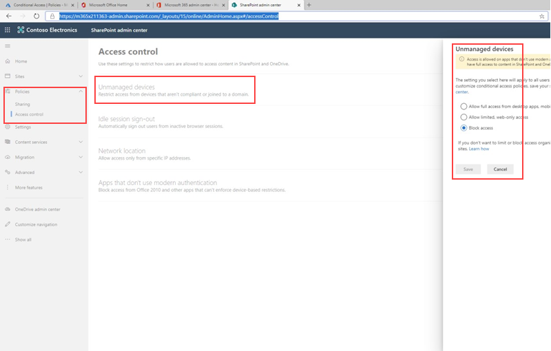
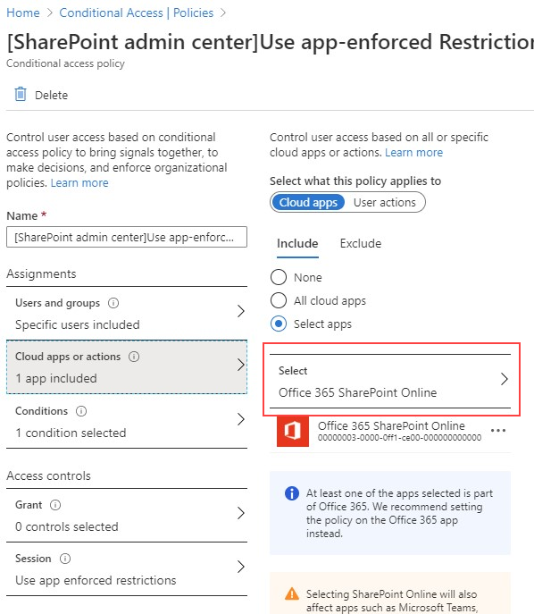

# Blockieren des Zugriffs auf SharePoint für bestimmte BenutzerBlock access to SharePoint for specific users

Das Anwenden einer beliebigen Richtlinie für den bedingten Zugriff auf SharePoint Online (SPO) wird auch für Teams übernommen.Applying any Conditional Access (CA) policy on SharePoint Online (SPO) is also applied to Teams. Einige Organisationen möchten jedoch den Zugriff auf SharePoint-Dateien blockieren (hochladen, herunterladen, anzeigen, bearbeiten, erstellen), aber ihren Mitarbeitern die Verwendung von Desktop-, Mobil-und Webclients von Teams auf nicht verwalteten Geräten ermöglichen.However, some organizations want to block access to SharePoint files (upload, download, view, edit, create) yet allow their employees to use Teams desktop, mobile, and web clients on unmanaged devices. Unter den Richtlinien für die Zertifizierungsstelle würde das Blockieren von SPO auch dazu führen, dass Teams blockiert werden.Under the CA policy rules, blocking SPO would lead to blocking Teams as well. In diesem Artikel wird erläutert, wie Sie diese Einschränkung umgehen und ihren Mitarbeitern ermöglichen, weiterhin Teams zu verwenden, während Sie den Zugriff auf Dateien, die in SpO gespeichert sind, vollständig blockieren.This article explains how you can work around this limitation and allow your employees to continue using Teams while completely blocking access to files stored in SPO.

> [!Note]
> Das Blockieren oder Einschränken des Zugriffs auf nicht verwalteten Geräten basiert auf Azure AD-bedingten Zugriffsrichtlinien.Blocking or limiting access on unmanaged devices relies on Azure AD conditional access policies. Informationen zur [Azure AD-Lizenzierung](https://azure.microsoft.com/pricing/details/active-directory/).Learn about [Azure AD licensing](https://azure.microsoft.com/pricing/details/active-directory/). Eine Übersicht über den bedingten Zugriff in Azure AD finden Sie unter [bedingter Zugriff in Azure Active Directory](https://docs.microsoft.com/azure/active-directory/conditional-access/overview).For an overview of conditional access in Azure AD, see [Conditional access in Azure Active Directory](https://docs.microsoft.com/azure/active-directory/conditional-access/overview). Informationen zu empfohlenen SharePoint-Zugriffsrichtlinien finden Sie unter [Richtlinien Empfehlungen zum Sichern von SharePoint-Websites und-Dateien](https://docs.microsoft.com/microsoft-365/enterprise/sharepoint-file-access-policies).For info about recommended SharePoint access policies, see [Policy recommendations for securing SharePoint sites and files](https://docs.microsoft.com/microsoft-365/enterprise/sharepoint-file-access-policies). Wenn Sie den Zugriff auf nicht verwalteten Geräten einschränken, müssen Benutzer auf verwalteten Geräten eine der [unterstützten Betriebssystem-und Browser Kombinationen](https://docs.microsoft.com/azure/active-directory/conditional-access/technical-reference#client-apps-condition)verwenden, oder Sie haben auch eingeschränkten Zugriff.If you limit access on unmanaged devices, users on managed devices must use one of the [supported OS and browser combinations](https://docs.microsoft.com/azure/active-directory/conditional-access/technical-reference#client-apps-condition), or they will also have limited access.

Sie können den Zugriff sperren oder einschränken für:You can block or limit access for:

- Benutzer in der Organisation oder nur einige Benutzer oder Sicherheitsgruppen.Users in the organization or only some users or security groups.

- Alle Websites in der Organisation oder nur einige Websites.All sites in the organization or only some sites.

Wenn Access blockiert ist, wird eine Fehlermeldung angezeigt.When access is blocked, users will see an error message. Das Blockieren des Zugriffs hilft, Sicherheit zu gewährleisten und sichere Daten zu schützen.Blocking access helps provide security and protects secure data. Wenn Access blockiert ist, wird eine Fehlermeldung angezeigt.When access is blocked, users will see an error message.

1. Öffnen Sie das SharePoint [Admin Center](https://admin.microsoft.com/sharepoint?page=accessControl&modern=true).Open the SharePoint [Admin Center](https://admin.microsoft.com/sharepoint?page=accessControl&modern=true).

2. Erweitern Sie **Richtlinien**  >  **Zugriffsrichtlinien**.Expand **Policies** > **Access Policies**.

3. Wählen Sie im Abschnitt **nicht verwaltete Geräte** die Option **Zugriff blockieren** aus, und wählen Sie **Speichern**aus.In the **Unmanaged Devices** section,  select **Block Access** and select **Save**.

   

4. Öffnen Sie das [Azure Active Directory](https://portal.azure.com/#blade/Microsoft_AAD_IAM/ConditionalAccessBlade/Policies) -Portal, und navigieren Sie zu den **Richtlinien für den bedingten Zugriff**.Open the [Azure Active Directory](https://portal.azure.com/#blade/Microsoft_AAD_IAM/ConditionalAccessBlade/Policies) portal and navigate to **Conditional Access Policies**.

    Sie werden sehen, dass eine neue Richtlinie von SharePoint erstellt wurde, die mit diesem Beispiel vergleichbar ist:You'll see a new policy has been created by SharePoint that's similar to this example:

    

5. Aktualisieren Sie die Richtlinie so, dass nur bestimmte Benutzer oder eine Gruppe darauf ausgerichtet sind.Update the policy to target only specific users or a group.

    

  > [!Note]
> Durch das Festlegen dieser Richtlinie wird der Zugriff auf das SharePoint-Verwaltungsportal reduziert.Setting this policy will cut your access to the SharePoint admin portal. Wir empfehlen, dass Sie die Ausschlussrichtlinie konfigurieren und die globalen und SharePoint-Administratoren auswählen.We recommended that you configure the exclusion policy and select the Global and SharePoint admins.

6. Überprüfen, ob nur SharePoint Online als gezielte Cloud-App ausgewählt istVerify that only SharePoint Online is selected as targeted Cloud App

    

7. Aktualisieren Sie die **Bedingungen** auch, um Desktop Clients einzubeziehen.Update **Conditions** to include desktop clients, as well.

    

8. Sicherstellen, dass **Grant Access** aktiviert istMake sure that **Grant access** is enabled

    

9. Stellen Sie sicher, dass die Anwendung **erzwungene Einschränkungen verwenden** aktiviert ist.Make sure **Use app enforced restrictions** is enabled.

10. Aktivieren Sie Ihre Richtlinie, und wählen Sie **Speichern**aus.Enable your policy and select **Save**.

    

Um Ihre Richtlinie zu testen, müssen Sie sich von jedem Client wie der Desktop-App "Teams" oder dem OneDrive-synchronisierungsclient abmelden und sich erneut anmelden, um die Richtlinie zu sehen.To test your policy, you need to sign out from any client such as the Teams desktop app or the OneDrive sync client and sign in again to see the policy working. Wenn Ihr Zugriff blockiert wurde, wird in Teams eine Meldung angezeigt, die besagt, dass das Element möglicherweise nicht vorhanden ist.If your access has been blocked, you'll see a message in Teams that states the item might not exist.

 

In SharePoint erhalten Sie eine Nachricht vom Zugriff verweigert.In Sharepoint, you'll receive an access denied message. 

## Verwandte ThemenRelated topics

[Steuern des Zugriffs auf nicht verwaltete Geräte in SharePointControl access for unmanaged devices in SharePoint](https://docs.microsoft.com/sharepoint/control-access-from-unmanaged-devices)
