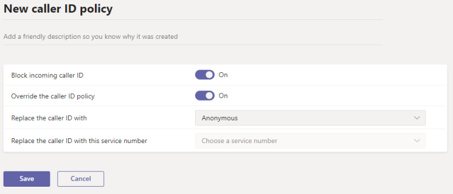

# Verwalten von Anrufer-ID-Richtlinien in Microsoft Teams

>[!INCLUDE [new-feature-teams-admin-center](includes/new-feature-teams-admin-center.md)]

Als Administrator können Sie die Anrufer-ID-Richtlinien in Microsoft Teams verwenden, um die Rufnummernanzeige (auch als Anruf Leitungs-ID bezeichnet) zu ändern oder zu blockieren. Standardmäßig kann die Telefonnummer von Teams-Benutzern angezeigt werden, wenn Sie einen Anruf an ein PSTN-Telefon durchführen, und die Telefonnummer der PSTN-Anrufer kann angezeigt werden, wenn Sie einen Teams-Nutzer anrufen. Sie können die Richtlinien für die Rufnummernanzeige verwenden, um eine alternative Telefonnummer für Teams-Benutzer in Ihrer Organisation anzuzeigen oder die Anzeige einer eingehenden Nummer zu blockieren.

Wenn Benutzer beispielsweise einen Anruf führen, können Sie die Rufnummernanzeige ändern, um die Haupttelefonnummer Ihrer Organisation anstelle der Telefonnummern der Benutzer anzuzeigen.

Sie verwalten die Richtlinien für die Rufnummernanzeige, indem Sie **Voice**  >  im Microsoft Teams Admin Center zu den Richtlinien für die VoIP **-Anruferkennung** wechseln. Sie können die globale Standardrichtlinie (org-Wide) verwenden oder benutzerdefinierte Richtlinien erstellen und zuweisen. Sofern Sie keine benutzerdefinierte Richtlinie erstellen und zuweisen, wird Benutzern in Ihrer Organisation automatisch die globale Standardrichtlinie zugewiesen.

## Erstellen einer benutzerdefinierten Anrufer-ID-Richtlinie

1. Wechseln Sie in der linken Navigationsleiste des Microsoft Teams Admin Center zu **VoIP**  >  **-Richtlinien für Anrufer**.
2. Klicken Sie auf **Hinzufügen**.  

3. Geben Sie eine Bezeichnung und eine Beschreibung für die Richtlinie ein.
4. Wählen Sie hier die gewünschten Einstellungen aus:

    - **Eingehende Anrufer-ID blockieren**: Aktivieren Sie diese Einstellung, um die Rufnummernanzeige für eingehende Anrufe zu blockieren.
    - **Überschreiben Sie die Richtlinie für die Rufnummern**Anzeige: Aktivieren Sie diese Einstellung, damit Benutzer die Einstellungen in der Richtlinie bezüglich der Anzeige der Rufnummer für Anrufer überschreiben können. Das bedeutet, dass Benutzer auswählen können, ob Sie Ihre Rufnummernanzeige anzeigen möchten. Weitere Informationen finden Sie unter [Endbenutzer-Steuerung der ausgehenden Rufnummern](https://docs.microsoft.com/microsoftteams/how-can-caller-id-be-used-in-your-organization#end-user-control-of-outbound-caller-id)Anzeige.
    - **Ersetzen Sie die Rufnummern**Anzeige durch: Legen Sie die Rufnummernanzeige für die Benutzer angezeigt, indem Sie eine der folgenden Optionen auswählen:

        - **Nummer des Benutzers**: zeigt die Nummer des Benutzers an. 
        - **Dienstnummer**: Hier können Sie eine Dienst Telefonnummer einrichten, die als Rufnummernanzeige angezeigt werden soll.
        - **Anonym**: zeigt die Rufnummernanzeige als "Anonym" an.

    - **Ersetzen Sie die Rufnummernanzeige durch diese Service-Nummer**: Wählen Sie eine Dienstnummer aus, um die Rufnummernanzeige der Nutzer zu ersetzen. Diese Option steht zur Verfügung, wenn Sie im **Feld Rufnummernanzeige ersetzen die Rufnummern** **Anzeige ausgewählt haben** .

5. Klicken Sie auf **Speichern**.

## Bearbeiten einer Rufnummernanzeige-Richtlinie

Sie können die globale Standardrichtlinie bearbeiten oder eine von Ihnen erstellte, benutzerdefinierte Richtlinie zuweisen. 

1. Wechseln Sie in der linken Navigationsleiste des Microsoft Teams Admin Center zu **VoIP**  >  **-Richtlinien für Anrufer**.
2. Wählen Sie die Richtlinie aus, indem Sie zunächst links neben die Richtlinienbezeichnung und dann auf **Bearbeiten** klicken.
3. Ändern Sie die gewünschten Einstellungen, und klicken Sie dann auf **Speichern**.

## Zuweisen einer benutzerdefinierten Anrufer-ID-Richtlinie zu Benutzern

[!INCLUDE [assign-policy](includes/assign-policy.md)]

## Verwandte Themen

[Neu – CsCallingLineIdentity](https://docs.microsoft.com/powershell/module/skype/new-cscallinglineidentity?view=skype-ps)

[Zuweisen von Richtlinien zu Ihren Benutzern in Microsoft Teams](assign-policies.md)
