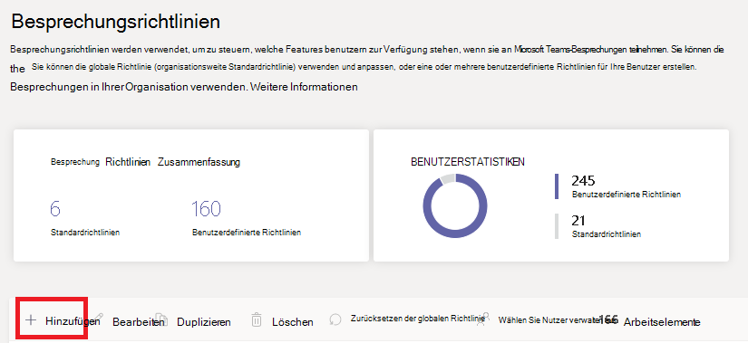

Konfigurieren der Desktopfreigabe in Microsoft Teams
============================================

Die Desktopfreigabe ermöglicht es Benutzern, während einer Besprechung oder eines Chats einen Bildschirm oder eine App anzuzeigen. Administratoren können die Bildschirmfreigabe in Microsoft Teams so konfigurieren, dass Benutzer einen gesamten Bildschirm, eine App oder eine Datei freigeben können. Sie können zulassen, dass Benutzer die Steuerung ermöglichen oder anfordern können, die PowerPoint-Freigabe zulassen, ein Whiteboard hinzufügen und das Freigebe zulassen. Sie können auch festlegen, ob anonyme oder externe Benutzer die Steuerung des freigegebenen Bildschirms anfordern können. Externe Teilnehmer an Teams-Besprechungen können wie folgt kategorisiert werden:

- Anonymer Benutzer
- Gastbenutzer
- B2B-Nutzer
- Federated-Benutzer

Um die Bildschirmfreigabe zu konfigurieren, erstellen Sie eine neue Besprechungsrichtlinie und weisen Sie diese dann den Benutzern zu, die Sie verwalten möchten.

**Im [Microsoft Teams Admin Center](https://admin.teams.microsoft.com/)**

1. Wählen Sie **Besprechungen** > **Besprechungsrichtlinien**.

    

2. Wählen Sie auf der Seite **Besprechungsrichtlinien** die Option **Hinzufügen**aus.

    

3. Weisen Sie Ihrer Richtlinie einen eindeutigen Titel zu und geben Sie eine kurze Beschreibung ein.

4. Wählen Sie aus der Dropdownliste unter **Inhaltsfreigabe** die gewünschte Option für den **Bildschirmfreigabemodus** aus:

   - **Gesamter Bildschirm**: Ermöglicht Benutzern die Freigabe des gesamten Bildschirms.
   - **Einzelne Anwendung**: Ermöglicht Benutzern die Beschränkung der Bildschirmfreigabe auf eine einzelne aktive Anwendung.
   - **Deaktiviert** – Deaktiviert die Bildschirmfreigabe.

    

  > [!Note]
  > Sie müssen die Anrufrichtlinie nicht aktivieren, damit Benutzer die Bildschirmfreigabe aus dem Chat verwenden können. Die Audiowiedergabe wird jedoch deaktiviert, bis Sie die Stummschaltung aufheben. Darüber hinaus kann der Benutzer, der den Bildschirm freigibt, auf **Audio hinzufügen** klicken, um die Audiowiedergabe zu aktivieren. Wenn die Anrufrichtlinie deaktiviert ist, können Benutzer der Bildschirmfreigabe in einer Chatsitzung keine Audiofunktionen hinzufügen.

5. Aktivieren oder deaktivieren Sie die folgenden Einstellungen:

    - **Zulassen, dass ein Teilnehmer die Steuerung erteilt oder anfordert** – ermöglicht es Mitgliedern des Teams, die Steuerung des Desktops oder der Anwendung des Referenten zu erteilen oder anzufordern.
    - **Einem externen Teilnehmer erlauben, die Kontrolle zu erteilen oder anzufordern** – Dies ist eine Richtlinie pro Benutzer. Ob diese Gruppe für einen Benutzer von einer Organisation eingerichtet wurde, steuert nicht, was externe Teilnehmer tun können, unabhängig davon, was der Besprechungsorganisator festgestellt hat. Dieser Parameter steuert, ob externen Teilnehmern die Kontrolle über den Bildschirm des Mitarbeiters gewährt werden kann, je nachdem, was der freigaber innerhalb der Besprechungsrichtlinien Ihrer Organisation festgesetzt hat.
    - **PowerPoint-Freigabe zulassen**: Ermöglicht Benutzern das Erstellen von Besprechungen, die das Hochladen und Freigeben von PowerPoint-Präsentationen zulassen.
    - **Whiteboard zulassen**: Ermöglicht Benutzern die Freigabe eines Whiteboards.
    - **Freigabe von Notizen zulassen**: Ermöglicht Benutzern, freigegebene Notizen zu erstellen.

6. Klicken Sie auf **Speichern**.

## Verwenden von PowerShell zum Konfigurieren des freigegebenen Desktops

Sie können auch das Cmdlet [Set-CsTeamsMeetingPolicy](https://docs.microsoft.com/powershell/module/skype/set-csteamsmeetingpolicy?view=skype-ps) verwenden, um die Desktopfreigabe zu steuern. Legen Sie die folgenden Parameter fest:

- Description
- ScreenSharingMode
- AllowPrivateCalling
- AllowParticipantGiveRequestControl
- AllowExternalParticipantGiveRequestControl
- AllowPowerPointSharing
- AllowWhiteboard
- AllowSharedNotes

[Erfahren Sie mehr über das csTeamsMeetingPolicy-Cmdlet ](https://docs.microsoft.com/powershell/module/skype/set-csteamsmeetingpolicy?view=skype-ps).
