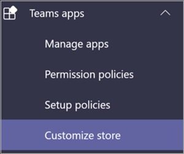

# Benutzerdefinierter Apps-Store in Microsoft Teams

[!INCLUDE [template](includes/preview-feature.md)]

Jetzt können Sie den App Store für Teams mit Ihrem Branding für Ihre Organisation anpassen, indem Sie Ihr Logo, benutzerdefinierte Hintergründe und benutzerdefinierte Textfarben hinzufügen, damit Sie für Endbenutzer einladender werden.

> [!Note]
> Für Änderungen am Branding müssen 24 Stunden wirksam werden.

Sie können im Admin Center auf den Bereich "anpassen" zugreifen, indem Sie " **Teams-apps**  >  **Anpassen** " auswählen.

  

In diesem Artikel werden die Features des benutzerdefinierten apps-Stores sowie deren Verwendung beschrieben.

## Anpassen Ihres organisationslogos

<!-- Bookmark used by Context Sensitive Help (CSH). Do not delete. -->

<!-- Do not remove the bookmark link above. -->

Hier können Sie Ihr Firmen Logo hochladen. Das ausgewählte Logo wird im Microsoft Teams-Client in **Apps**  >  **für Ihre Mandantenseite erstellten** apps angezeigt.

Wenn Sie die Option **Bild auswählen** auswählen, können Sie die Datei Ihrer Wahl hochladen. Das Logo sollte 240x60 sein, oder es wird auf diese Größe skaliert. Sie darf nicht größer als 5 MB sein. Folgende Formate werden unterstützt:

- . svg
- PNG
- . jpg

Das Logo wird in der oberen rechten Ecke des Mandanten-App-Katalogs im Teams-Store angezeigt.

## Anpassen Ihres kleinen Logos

<!-- Bookmark used by Context Sensitive Help (CSH). Do not delete. -->

<!-- Do not remove the bookmark link above. -->

Ihr Organisations-logomark oder kleines Logo ist ein Bild oder Symbol, das die Marke Ihrer Organisation repräsentiert und den Namen Ihres Unternehmens nicht enthält. Die Lovemark hilft Teammitgliedern beim Identifizieren des APP-Speichers. Das ausgewählte Logo wird auf der Seite "Teams-Client in Apps" angezeigt.

Wenn Sie die Option **Bild auswählen** auswählen, können Sie die Datei Ihrer Wahl hochladen. Die logomark sollte 32 x 32 Pixel sein, oder Sie wird auf diese Größe skaliert. Sie darf nicht größer als 5 MB sein. Folgende Formate werden unterstützt:

- . svg
- PNG
- . jpg

Das kleine Logo wird neben dem Abschnittstitel **für den erstellten Mandanten** auf der Startseite des Teams Store angezeigt.

## Anpassen der Hintergrundfarbe

<!-- Bookmark used by Context Sensitive Help (CSH). Do not delete. -->

<!-- Do not remove the bookmark link above. -->

Stellen Sie sicher, dass der Hintergrund genügend Kontrast zum Text aufweist, damit die Benutzer den Text deutlich lesen können. Der Hintergrund wird im Teams-Client in **apps** angezeigt, die  >  **für den Mandanten Kopf erstellt wurden** .

Sie haben nun die folgenden Optionen:

- Verwenden des standardmäßigen Hintergrunddesigns für Team Client
- Wählen Sie ein Bild aus. Wenn Sie das Hintergrundbild auswählen, können Sie die Datei Ihrer Wahl hochladen. Der Hintergrund sollte 1212x100 Pixel sein, oder er wird auf diese Größe skaliert. Sie darf nicht größer als 5 MB sein. Folgende Formate werden unterstützt:
  - . svg
  - PNG
  - . jpg
- Wählen Sie einen benutzerdefinierten Hintergrund aus. Wenn Sie **eine benutzerdefinierte Farbe** auswählen auswählen, wird eine Farbauswahl geöffnet. Wählen Sie die gewünschte Farbe aus, indem Sie die Skalierung der Farbauswahl anpassen.

Das Hintergrundbild oder die Hintergrundfarbe wird als Hintergrund für das oberste Banner im teamtenant-App-Katalog verwendet.

## Anpassen der Textfarbe Ihres Namens

<!-- Bookmark used by Context Sensitive Help (CSH). Do not delete. -->

<!-- Do not remove the bookmark link above. -->

Stellen Sie sicher, dass die Textfarbe genügend Kontrast zum Hintergrund aufweist, damit die Benutzer den Namen Ihrer Organisation deutlich lesen können. Der Text wird im Microsoft Teams-Client in **apps** angezeigt, die  >  **für den Mandanten Kopf erstellt wurden** .

Wenn Sie **eine benutzerdefinierte Farbe** auswählen auswählen, wird eine Farbauswahl geöffnet. Wählen Sie die gewünschte Farbe aus, indem Sie die Skalierung der Farbauswahl anpassen.

 

## Abschließen der Anpassung Ihres Team-apps-Speichers

Wenn Sie mit dem Anpassen Ihres apps Stores fertig sind, wählen Sie **Speichern** aus, um die Änderungen zu speichern.
Um eine Vorschau der Änderungen anzuzeigen, wählen Sie **Vorschau des App-Stores** aus, um eine Darstellung Ihres angepassten Apps Store anzuzeigen.

> [!Note]
> Die Darstellung kann von der endgültigen Version Ihres angepassten APP-Speichers abweichen, da einige Standardfarben auf der Version des Teams-Clients Ihrer Benutzer basieren.

## Verwandter Artikel

[Verwalten von apps](manage-apps.md)
