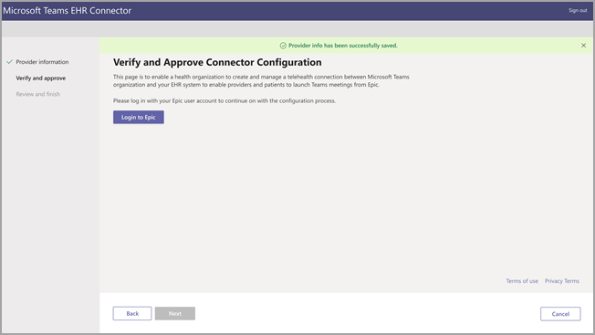
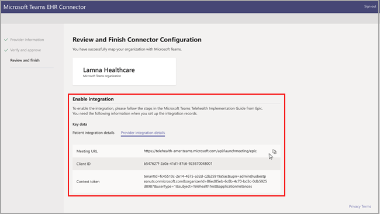

# Virtuelle Besuche mit Teams – Integration in EPA

Der Microsoft Teams Electronic Health Record (EHR) Connector macht es Klinikern einfach, einen virtuellen Patienten Besuch oder eine Konsultation mit einem anderen Anbieter in Teams direkt aus dem EPA-System zu starten. Microsoft Teams, das auf der Microsoft 365-Cloud basiert, ermöglicht eine einfache, sichere Zusammenarbeit und Kommunikation mit Chat-, Video-, sprach-und Gesundheitstools in einem einzigen Hub, der die Compliance mit HIPAA, HITECH-Zertifizierung und vielem mehr unterstützt.

Die Kommunikations-und Zusammenarbeitsplattform von Teams macht es Klinikern einfach, die Übersichtlichkeit fragmentierter Systeme zu durch Schneiden, damit Sie Zeit damit verbringen können, die bestmögliche Versorgung zu ermöglichen. Microsoft Teams Electronic Health Record (EHR) Connector kann:

- Starten Sie virtuelle Besuche von Teams sowohl über Anbieter-als auch über Patienten Portale.

- Schreiben Sie zurück in die EPA-Metadaten bei Connect-und Disconnect-Ereignissen, um automatische Überwachung und Datensatzspeicherung zu ermöglichen.

- Integrieren Sie in vorhandene Klinik-und Patienten Workflows, während Sie Microsoft Teams verwenden können.

  Schauen Sie sich das Video an, wie Sie virtuelle Besuche im EPA-Portal verwalten können.

> [!VIDEO https://www.microsoft.com/videoplayer/embed/RE4HAtn]

## Vorbereitung

Sie müssen sicherstellen, dass Sie über die folgenden Voraussetzungen verfügen, bevor Sie den EHR-Connector integrieren können:

- Aktives Abonnement von Microsoft Cloud für Healthcare oder Abonnement für das Standalone-Angebot von Microsoft Teams EHR Connector.

- Benutzer müssen über eine geeignete Microsoft 365-oder Office 365-Lizenz verfügen, die Microsoft Teams-Besprechungen enthält.

- Microsoft Teams sollten innerhalb der Organisation angenommen und verwendet werden.

- Organisationen müssen mit epic-Version November 2018 oder höher verfügen.

- Ihre Systeme müssen alle [Voraussetzungen für Software und Browser](https://docs.microsoft.com/microsoftteams/hardware-requirements-for-the-teams-app)erfüllen.

Darüber hinaus benötigen Sie Informationen von den folgenden Personen in Ihrer Organisation:

- Microsoft 365-Administrator

- Epic-Administrator

> [!Note]
> Fordern Sie Ihren epischen Administrator auf, den im epic Marketplace verfügbaren Leitfaden für die Epic-Microsoft Teams für die Telehealth-Integration bereitzustellen.

## Connector-Setup

Die Einrichtung des Connectors erfordert Folgendes:

- [Starten des EPA-Connector-Konfigurations Portals](ehr-admin.md#launch-the-ehr-connector-configuration-portal)
- [Konfigurieren von Informationen zur Anbieterorganisation](ehr-admin.md#configure-provider-organization-information)
- [Überprüfen und genehmigen der Konfiguration](ehr-admin.md#verify-and-approve-the-configuration)
- [Überprüfen und Beenden der Konfiguration](ehr-admin.md#review-and-finish-the-configuration)

### [Starten des EPA-Connector-Konfigurations Portals](#launch-the-ehr-connector-configuration-portal)

Wenn Sie Ihre Gesundheitsorganisation so konfigurieren, dass virtuelle Besuche mit Microsoft Teams gestartet werden, starten Sie das EPA-Connector-Konfigurations Portal. Verwenden Sie die Test-URL, um den Connector für Ihre epische Testumgebung zu konfigurieren. Verwenden Sie die Produktions-URL, wenn Sie bereit sind, ihre epische Produktionsumgebung zu aktivieren.
  
- Test Umgebung [https://ehrconnector-ppe.teams.microsoft.com](https://ehrconnector-ppe.teams.microsoft.com)
- Produktionsumgebung [https://ehrconnector.teams.microsoft.com](https://ehrconnector.teams.microsoft.com)

Der Microsoft 365-Administrator und der epic-Administrator Ihrer Organisation müssen die Informations-und Integrationsschritte im Konfigurations Portal ausführen. Für epische Konfigurationsschritte wenden Sie sich an die epische Ressource, die Ihrer Organisation zugewiesen ist.

### [Konfigurieren von Informationen zur Anbieterorganisation](#configure-provider-organization-information)

Dieser Schritt muss vom Microsoft 365-Administrator ausgeführt werden. Der Microsoft 365-Administrator muss das Connector-Konfigurations Portal starten und sich mit Microsoft-Anmeldeinformationen anmelden, um den Konfigurationsprozess zu starten.

Um diesen Schritt ausführen zu können, muss der Microsoft 365-Administrator eine gültige FHIR-Basis-URL von Ihrem Microsoft 365-Administrator und den Benutzernamen des epischen Administrators erhalten, der die Konfiguration genehmigen wird. Der Microsoft 365-Administrator muss die Seite Connector-Konfiguration starten und sich mit Microsoft-Anmeldeinformationen anmelden, um den Konfigurationsvorgang zu starten.

- Die FHIR-Basis-URL ist eine statische Adresse, die Ihrem Server-FHIR-API-Endpunkt entspricht. Eine Beispiel-URL ist `https://lamnahealthcare.org/fihr/auth/connect-ocurprd-oauth/api/FHDST` .

- Name der Konfigurations genehmigenden Person ist der Name des epischen Systemadministrators, der für die Genehmigung der Konfiguration verantwortlich ist.

  

### [Überprüfen und genehmigen der Konfiguration](#verify-and-approve-the-configuration)

Der epic-Administrator für Ihre Gesundheitsorganisation, der als genehmigende Person hinzugefügt wurde, muss nun dieselbe EPA-Connector-URL aus dem vorherigen Schritt verwenden, um sich mit den Microsoft 365-Anmeldeinformationen anzumelden. Nach erfolgreicher Überprüfung wird die genehmigende Person aufgefordert, sich mit ihren epischen Anmeldeinformationen anzumelden, um die epische Organisation zu überprüfen.

> [!Note]
> Der Microsoft 365-Administrator und der epic-Administrator in ihren Organisationen können dieselbe Person sein. In diesem Fall fügen Sie im ersten Schritt ihren eigenen Benutzernamen als genehmigende Person hinzu. Sie müssen sich weiterhin bei epic anmelden, um Ihren Zugriff zu überprüfen. Die epische Anmeldung wird nur zur Überprüfung ihrer FHIR-Basis-URL verwendet. Microsoft speichert keine Anmeldeinformationen oder keinen Zugriff auf EHR-Daten mit dieser Anmeldung.

  

Nach einer erfolgreichen epischen Anmeldung **muss** der epic-Administrator die Konfiguration genehmigen. Wenn die Konfiguration nicht korrekt ist, kann der Microsoft 365-Administrator die ursprünglichen Konfigurationen ändern, indem Sie sich erneut beim Microsoft EPA Connector-Portal anmelden.

### [Überprüfen und Beenden der Konfiguration](#review-and-finish-the-configuration)

Wenn die Konfigurationsinformationen vom epic-Administrator genehmigt wurden, werden Ihnen Integrations Einträge für den Start des Patienten und des Anbieters angezeigt. Diese Einträge sind notwendig, um die virtuelle Besuchs Konfiguration in epic abzuschließen. Weitere Informationen finden Sie im Epic-Microsoft Teams Telehealth Integration Guide.

> [!Note]  
> Der Microsoft 365-oder epic-Administrator kann sich bei Bedarf beim Konfigurations Portal anmelden, um integrationsdatensätze anzuzeigen und die Organisationskonfiguration zu ändern.

## Virtuelle Besuche von Teams starten

Nachdem Sie die EPA-Connector-Schritte und die epische Konfiguration abgeschlossen haben, ist Ihre Organisation bereit, Video Besuche mit Microsoft Teams zu unterstützen.

### Voraussetzungen für virtuelle Besuche

- Ihre Systeme müssen alle [Voraussetzungen für Software und Browser](https://docs.microsoft.com/microsoftteams/hardware-requirements-for-the-teams-app)erfüllen.

- Die Organisation des Gesundheitswesens muss das Setup zwischen der epischen Organisation und der Microsoft 365-Organisation abgeschlossen haben.

### Anbieter Erfahrung

Gesundheitsdienstleister aus Ihrer Organisation können auch an virtuellen besuchen mit Microsoft Teams aus ihren epischen Anbieter Anwendungen (Hyperraum, Haiku, Canto) teilnehmen. Die Schaltfläche **Virtueller Besuch beginnen** ist in den Anbieter Fluss eingebettet.

Die wichtigsten Features der Anbieter Oberfläche:

- Anbieter können mit unterstützten Browsern oder der Microsoft Teams-Anwendung an virtuellen besuchen teilnehmen.

- Anbieter müssen eine einmalige Anmeldung mit Ihrem Microsoft 365-Konto durchführen, wenn Sie sich zum ersten Mal an einem virtuellen Besuch beteiligen.

- Nach der einmaligen Anmeldung wird der Anbieter direkt zu dem virtuellen Termin in Microsoft Teams weitergeleitet. (Der Anbieter muss bei Microsoft Teams angemeldet sein).

- Der Anbieter kann Echtzeitupdates der Teilnehmer sehen, die für einen bestimmten Termin eine Verbindung herstellen und die Verbindung trennen. Der Anbieter kann sehen, wann der Patient mit einem virtuellen Besuch verbunden ist.

  

### Patientenerfahrung

Der Connector unterstützt Patienten bei der Teilnahme an virtuellen besuchen über myChart Web und Mobile. Zum Zeitpunkt der Ernennung können die Patienten über die Schaltfläche **Virtueller Besuch beginnen** einen virtuellen Besuch von myChart beginnen.

Die wichtigsten Funktionen der Patientenerfahrung:

- Patienten können an virtuellen besuchen von modernen Webbrowsern auf Desktop-und Mobiltelefonen ohne App-Installation teilnehmen.

- Patienten können mit nur einem Mausklick an virtuellen besuchen teilnehmen, und es gibt kein zusätzliches Konto oder keine Anmeldung erforderlich.

- Patienten müssen kein Microsoft-Konto erstellen oder sich anmelden, um einen virtuellen Besuch zu starten.

- Die Patienten werden in eine Lobby gestellt, bis der Leistungserbringer sich dem Termin anschließt und Sie dem virtuellen Besuch zugibt.

- Das Testen von Video und Mikrofon steht in der Lobby zur Verfügung, bevor Sie sich dem virtuellen Besuch anschließen.

  

> [!Note]
> Epic, myChart, Haiku und Canto sind Marken von epic Systems Corporation.

### Datenschutz und Speicherort der Daten

Die Integration von Teams in EPA-Systeme optimiert die Menge der Daten, die während der Integration und beim virtuellen Besuchs Fluss verwendet und gespeichert werden. Die Lösung folgt den allgemeinen Prinzipien und Richtlinien für die Datenverwaltung in Teams, die in den Datenschutzbestimmungen von Teams erläutert werden.

Der Microsoft Teams EHR Connector speichert und übermittelt keine identifizierbaren personenbezogenen Daten oder Gesundheitsaufzeichnungen von Patienten oder Leistungserbringer aus dem EPA-System. Die einzigen Daten, die vom EPA-Connector gespeichert werden, sind die eindeutige ID des EPA-Benutzers, die während der Einrichtung von Teams verwendet wird. Die eindeutige ID des EPA-Benutzers wird in einer der drei geografischen Regionen gespeichert, die in dem Artikel, in dem [Ihre Microsoft 365-Kundendaten gespeichert sind,](https://docs.microsoft.com/microsoft-365/enterprise/o365-data-locations?view=o365-worldwide#data-center-geographies) beschrieben sind. Alle Chats, Aufzeichnungen und anderen Daten, die von den Besprechungsteilnehmern in Teams eingegeben wurden, werden gemäß den vorhandenen Speicherrichtlinien gespeichert. Wenn Sie weitere Informationen zum Speicherort von Daten in Microsoft Teams erfahren möchten, besuchen Sie die [Speicherorte von Daten in Teams](https://docs.microsoft.com/microsoftteams/location-of-data-in-teams).
