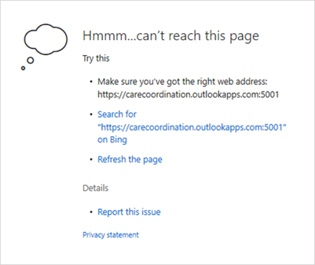
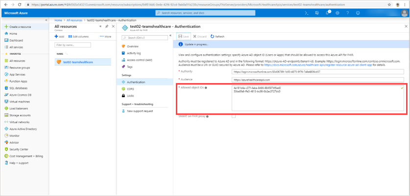

# Verbinden der Patienten-App mit Azure API for FHIRConnect the Patients app to Azure API for FHIR

> [!NOTE]
> Die Patienten-App wurde im 30. Oktober, 2020, eingestellt und durch die [Listen-App](https://support.microsoft.com/office/get-started-with-lists-in-teams-c971e46b-b36c-491b-9c35-efeddd0297db) in Teams ersetzt.Effective October 30, 2020, the Patients app has been retired and replaced by the [Lists app](https://support.microsoft.com/office/get-started-with-lists-in-teams-c971e46b-b36c-491b-9c35-efeddd0297db) in Teams. Patienten-App-Daten werden im Gruppenpostfach der Office 365-Gruppe gespeichert, die das Team zurückgibt.Patients app data is stored in the group mailbox of the Office 365 group that backs the team. Alle Daten, die mit der Patienten-App verknüpft sind, werden in dieser Gruppe beibehalten, auf die Benutzeroberfläche kann jedoch nicht mehr zugegriffen werden.All data associated with the Patients app is retained in this group but can no longer be accessed through the user interface. Benutzer können Ihre Listen mithilfe der [Listen-App](https://support.microsoft.com/office/get-started-with-lists-in-teams-c971e46b-b36c-491b-9c35-efeddd0297db)erneut erstellen.Users can re-create their lists using the [Lists app](https://support.microsoft.com/office/get-started-with-lists-in-teams-c971e46b-b36c-491b-9c35-efeddd0297db).
>
>Mit Listen können Betreuerteams in Ihrer Gesundheitsorganisation patientenlisten für Szenarien erstellen, die von runden und interdisziplinären Teambesprechungen bis hin zur allgemeinen Patientenüberwachung reichen.With Lists, care teams in your healthcare organization can create patient lists for scenarios ranging from rounds and interdisciplinary team meetings to general patient monitoring. Schauen Sie sich die Vorlage Patienten in Listen an, um zu beginnen.Check out the Patients template in Lists to get started. Weitere Informationen zum Verwalten der Listen-app in Ihrer Organisation finden Sie unter [Verwalten der Listen-App](../../manage-lists-app.md).To learn more about how to manage the Lists app in your organization, see [Manage the Lists app](../../manage-lists-app.md).

Führen Sie die folgenden Schritte aus, um der Patienten-app in Microsoft Teams den Zugriff auf eine Azure-API für die FHIR-Instanz zu ermöglichen.Follow these steps to allow the Patients app in Microsoft Teams access to an Azure API for FHIR instance. In diesem Artikel wird davon ausgegangen, dass Sie eine [Azure-API für die FHIR-Instanz](https://azure.microsoft.com/services/azure-api-for-fhir/) eingerichtet und in Ihrem Mandanten konfiguriert haben.This article assumes that you have an [Azure API for FHIR instance](https://azure.microsoft.com/services/azure-api-for-fhir/) set up and configured in your tenant.  Wenn Sie noch keine Azure-API für die FHIR-Instanz in Ihrem Mandanten erstellt haben, lesen Sie [Schnellstart: Bereitstellen der Azure-API für FHIR mithilfe von Azure Portal](https://docs.microsoft.com/azure/healthcare-apis/fhir-paas-portal-quickstart).If you haven’t yet created an Azure API for FHIR instance in your tenant, see [Quickstart: Deploy Azure API for FHIR using Azure portal](https://docs.microsoft.com/azure/healthcare-apis/fhir-paas-portal-quickstart).

1. Klicken Sie [hier](https://login.microsoftonline.com/common/adminConsent?client_id=4aee3506-b263-43e0-ba31-1468fa7b2806) , um die Zustimmung des Administrators für die Patienten-APP zu erteilen.Click [here](https://login.microsoftonline.com/common/adminConsent?client_id=4aee3506-b263-43e0-ba31-1468fa7b2806) to grant admin consent for the Patients app. Wenn Sie dazu aufgefordert werden, melden Sie sich mit Ihrem mandantenadministrator oder den globalen Administratoranmeldeinformationen an, und klicken Sie dann auf **annehmen** , um die erforderlichen Berechtigungen zu erteilen.When prompted, sign in using your tenant admin or global admin credentials, and then click **Accept** to grant the required permissions.

    

    Nachdem Sie die Ansicht akzeptiert haben, schließen Sie das Fenster.After you accept, close the window. Es wird eine Seite angezeigt, die wie folgt aussehen kann.You'll see a page that may look like this. Sie können die Fehlermeldung auf der Seite ignorieren.You can ignore the error message on the page. Sie ist harmlos und gibt an, dass die Zustimmung gewährt wird.It's harmless and indicates that consent is granted. (Wir arbeiten an einer benutzerfreundlicheren Seite für diese URL.(We're working on a more user-friendly page for this URL. Bleiben Sie dran!)Stay tuned!)

    
    
2. Melden Sie sich mit Ihren Administratoranmeldeinformationen beim [Azure-Portal](https://portal.azure.com) an.Sign in to the [Azure portal](https://portal.azure.com) with your admin credentials.

3. Wählen Sie in der linken Navigationsleiste **Azure Active Directory** aus, und wählen Sie dann **Enterprise-Anwendungen** aus.In the left navigation, select **Azure Active Directory** , and then select **Enterprise Applications** .

    Suchen Sie nach einer Zeile mit dem Namen **patients (dev)** , und kopieren Sie dann den Wert in der Spalte **Objekt-ID** in Ihre Zwischenablage.Look for a row named **Patients (dev)** , and then copy the value in the **Object ID** column to your clipboard.
    
    
    
4. Wechseln Sie zur Azure-API für FHIR-Ressourceninstanz, mit der Sie die Patienten-App verbinden möchten (entweder durchsuchen oder durch Durchsuchen Ihrer Ressourcen), und öffnen Sie dann die Einstellungen für diese Instanz.Go to the Azure API for FHIR resource instance to which you want to connect the Patients app (either by searching for it or by browsing through your resources), and then open the settings for that instance.

    

5. Klicken Sie auf **Authentifizierung** , und fügen Sie dann die Objekt-ID, die Sie in Schritt 3 kopiert haben, in das Feld **zugelassene Objekt-IDs** ein.Click **Authentication** , and then paste the object ID that you copied in step 3 to the **Allowed object IDs** box. Dadurch kann die Patienten-App auf den FHIR-Server zugreifen.This allows the Patients app to access the FHIR server. Nachdem Sie die Objekt-ID eingefügt haben, wird Sie von Azure Active Directory überprüft, und daneben wird ein grünes Häkchen angezeigt.After you paste the object ID, Azure Active Directory validates it, and a green check mark appears next to it.

    

6. Klicken Sie auf **Speichern** .Click **Save** . Dadurch wird die Instanz erneut bereitgestellt, was einige Minuten dauern kann.This redeploys the instance, which can take a few minutes.

7. Klicken Sie auf **Übersicht** , und kopieren Sie dann die URL aus **FHIR-metadatenpunkt** .Click **Overview** , and then copy the URL from **FHIR metadata endpoint** . Entfernen Sie das Metadata-Tag, um die FHIR-Server-URL abzurufen.Remove the metadata tag to get the FHIR server URL. Beispiel: https://test02-teamshealth.azurehealthcareapis.com/ .For example, https://test02-teamshealth.azurehealthcareapis.com/. 

    

8. Wechseln Sie in Teams zur Instanz der Patienten-APP, die in Ihrem Team geladen ist, klicken Sie auf **Einstellungen** , und geben Sie dann im Feld **Link** die URL des FHIR-Servers ein.In Teams, go to the Patients app instance that's loaded in your team, click **Settings** , and then in the **Link** box, enter the FHIR server endpoint URL. Klicken Sie dann auf **verbinden** , um eine Verbindung herzustellen, und suchen und Hinzufügen von Patienten zu Ihrer Liste.Then, click **Connect** to establish a connection and search and add patients to your list.  

    
    
    Wenn beim Herstellen einer Verbindung mit Teams während dieses Schritts eine Fehlermeldung angezeigt wird, senden Sie einen detaillierten Screenshot des Fehlers, Protokolle von [Fiddler](https://www.telerik.com/download/fiddler) und alle anderen Repro Schritte in einer e-Mail mit einer Betreffzeile der Problembehandlung "Patienten-App – EMR-Modus" zu [teamsforhealthcare@Service.Microsoft.com](mailto:teamsforhealthcare@service.microsoft.com).If you get an error when connecting to Teams during this step, send a detailed screenshot of the error, logs from [Fiddler](https://www.telerik.com/download/fiddler) and any other repro steps in an email with a subject line of “Patients App – EMR mode troubleshooting” to [teamsforhealthcare@service.microsoft.com](mailto:teamsforhealthcare@service.microsoft.com).

## Verwandte ThemenRelated topics

- [Übersicht der Patienten-AppPatients app overview](patients-app-overview.md)
- [Integration von elektronischen Datensätzen aus dem Gesundheitswesen in Microsoft TeamsIntegrating Electronic Healthcare Records into Microsoft Teams](patients-app.md)
