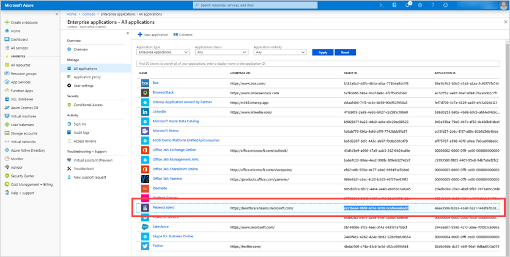
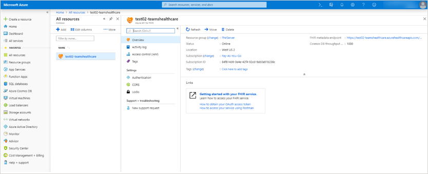

# Verbinden der Patienten-App mit Azure API for FHIR

> [!IMPORTANT]
> **Die Patienten-APP wird ab dem 30. Oktober 2020 veraltet sein, und die Benutzer können Sie nicht mehr aus dem App Store von Teams installieren. Wir empfehlen Ihnen, die Listen- [App](https://support.microsoft.com/office/get-started-with-lists-in-teams-c971e46b-b36c-491b-9c35-efeddd0297db) in Teams noch heute zu verwenden.**
>
>Patienten-App-Daten werden im Gruppenpostfach der Office 365-Gruppe gespeichert, die das Team zurückgibt. Wenn die patients-App eingestellt wird, werden alle damit verknüpften Daten in dieser Gruppe beibehalten, auf die Benutzeroberfläche kann jedoch nicht mehr zugegriffen werden. Aktuelle Benutzer können Ihre Listen mithilfe der [Listen-App](https://support.microsoft.com/office/get-started-with-lists-in-teams-c971e46b-b36c-491b-9c35-efeddd0297db)erneut erstellen.
>
>Die [Listen-App](https://support.microsoft.com/office/get-started-with-lists-in-teams-c971e46b-b36c-491b-9c35-efeddd0297db) ist für alle Teams-Benutzer vorinstalliert und steht in allen Teams und Kanälen als Registerkarte zur Verfügung. Mit Listen können Betreuerteams mithilfe der integrierten Patienten Vorlage, von Grund auf neu oder durch Importieren von Daten nach Excel, patientenlisten erstellen. Weitere Informationen zum Verwalten der Listen-app in Ihrer Organisation finden Sie unter [Verwalten der Listen-App](../../manage-lists-app.md).

Führen Sie die folgenden Schritte aus, um der Patienten-app in Microsoft Teams den Zugriff auf eine Azure-API für die FHIR-Instanz zu ermöglichen. In diesem Artikel wird davon ausgegangen, dass Sie eine [Azure-API für die FHIR-Instanz](https://azure.microsoft.com/services/azure-api-for-fhir/) eingerichtet und in Ihrem Mandanten konfiguriert haben.  Wenn Sie noch keine Azure-API für die FHIR-Instanz in Ihrem Mandanten erstellt haben, lesen Sie [Schnellstart: Bereitstellen der Azure-API für FHIR mithilfe von Azure Portal](https://docs.microsoft.com/azure/healthcare-apis/fhir-paas-portal-quickstart).

1. Klicken Sie [hier](https://login.microsoftonline.com/common/adminConsent?client_id=4aee3506-b263-43e0-ba31-1468fa7b2806) , um die Zustimmung des Administrators für die Patienten-APP zu erteilen. Wenn Sie dazu aufgefordert werden, melden Sie sich mit Ihrem mandantenadministrator oder den globalen Administratoranmeldeinformationen an, und klicken Sie dann auf **annehmen** , um die erforderlichen Berechtigungen zu erteilen.

    

    Nachdem Sie die Ansicht akzeptiert haben, schließen Sie das Fenster. Es wird eine Seite angezeigt, die wie folgt aussehen kann. Sie können die Fehlermeldung auf der Seite ignorieren. Sie ist harmlos und gibt an, dass die Zustimmung gewährt wird. (Wir arbeiten an einer benutzerfreundlicheren Seite für diese URL. Bleiben Sie dran!)

    
2. Melden Sie sich mit Ihren Administratoranmeldeinformationen beim [Azure-Portal](https://portal.azure.com) an.
3. Wählen Sie in der linken Navigationsleiste **Azure Active Directory**aus, und wählen Sie dann **Enterprise-Anwendungen**aus.
    Suchen Sie nach einer Zeile mit dem Namen **patients (dev)**, und kopieren Sie dann den Wert in der Spalte **Objekt-ID** in Ihre Zwischenablage.
    
4. Wechseln Sie zur Azure-API für FHIR-Ressourceninstanz, mit der Sie die Patienten-App verbinden möchten (entweder durchsuchen oder durch Durchsuchen Ihrer Ressourcen), und öffnen Sie dann die Einstellungen für diese Instanz.

    

5. Klicken Sie auf **Authentifizierung**, und fügen Sie dann die Objekt-ID, die Sie in Schritt 3 kopiert haben, in das Feld **zugelassene Objekt-IDs** ein. Dadurch kann die Patienten-App auf den FHIR-Server zugreifen. Nachdem Sie die Objekt-ID eingefügt haben, wird Sie von Azure Active Directory überprüft, und daneben wird ein grünes Häkchen angezeigt.

    

6. Klicken Sie auf **Speichern**. Dadurch wird die Instanz erneut bereitgestellt, was einige Minuten dauern kann.
7. Klicken Sie auf **Übersicht**, und kopieren Sie dann die URL aus **FHIR-metadatenpunkt**. Entfernen Sie das Metadata-Tag, um die FHIR-Server-URL abzurufen. Beispiel: https://test02-teamshealth.azurehealthcareapis.com/ . 

    

8. Wechseln Sie in Teams zur Instanz der Patienten-APP, die in Ihrem Team geladen ist, klicken Sie auf **Einstellungen**, und geben Sie dann im Feld **Link** die URL des FHIR-Servers ein. Klicken Sie dann auf **verbinden** , um eine Verbindung herzustellen, und suchen und Hinzufügen von Patienten zu Ihrer Liste.  

    
    
    Wenn beim Herstellen einer Verbindung mit Teams während dieses Schritts eine Fehlermeldung angezeigt wird, senden Sie einen detaillierten Screenshot des Fehlers, Protokolle von [Fiddler](https://www.telerik.com/download/fiddler) und alle anderen Repro Schritte in einer e-Mail mit einer Betreffzeile der Problembehandlung "Patienten-App – EMR-Modus" zu [teamsforhealthcare@Service.Microsoft.com](mailto:teamsforhealthcare@service.microsoft.com).

## Verwandte Themen

- [Übersicht der Patienten-App](patients-app-overview.md)
- [Integration von elektronischen Datensätzen aus dem Gesundheitswesen in Microsoft Teams](patients-app.md)
