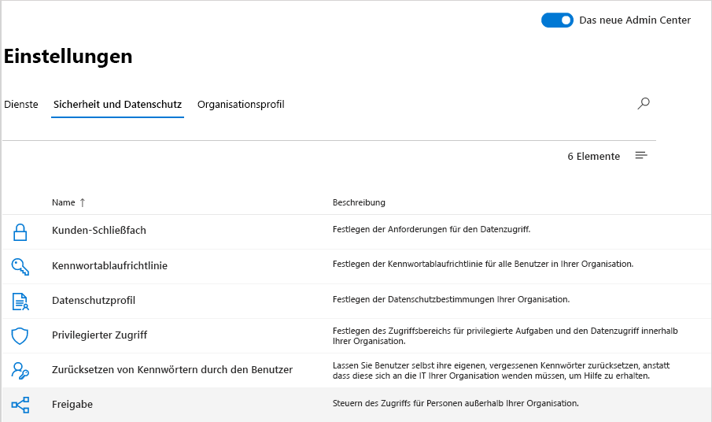
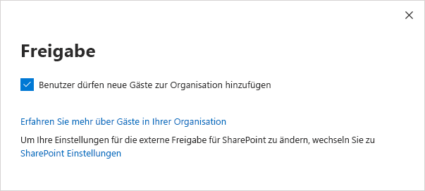

Checkliste für den Microsoft Teams-Gastzugriff
=========================================

Verwenden Sie diese Checkliste, um den Gastzugriff in Microsoft Teams einzurichten und zu konfigurieren. Sie müssen ein globaler Administrator oder ein Teams-Administrator sein, um diese Änderungen vornehmen zu können.

> [!IMPORTANT]
> Möglicherweise müssen Sie einige Stunden warten, bis Ihre Änderungen wirksam werden. 

Schauen Sie sich dieses kurze Video an (5:31 Minuten), um zu sehen, wie Sie in Microsoft 365, einschließlich Teams, den Gastzugriff aktivieren.

> [!VIDEO https://www.microsoft.com/videoplayer/embed/RE44NTr?autoplay=false]

## Schritt 1: Aktivieren des Gastzugriffs in Teams auf Organisationsebene

Wenn Sie den Gastzugriff aktivieren möchten, wechseln Sie zum Admin Center unter <a href="https://go.microsoft.com/fwlink/p/?linkid=2024339" target="_blank">https://admin.microsoft.com</a> . 

1. Wählen Sie im Teams Admin Center **Organisationsweite Einstellungen** > **Gastzugriff**.
2. Legen Sie **Gastzugriff in Microsoft Teams ermöglichen** auf **An** fest.

    

3. Auf derselben Seite können Sie die Einstellungen **Anruf**, **Besprechung** und **Messaging** für Gäste ein- oder ausschalten.
4. Klicken Sie auf **Speichern**.

> [!TIP]
> Wenn Sie die Standardeinstellungen in Azure Active Directory, SharePoint Online und Microsoft 365-Gruppen verwenden, ist möglicherweise die Konfiguration des Gastzugriffs abgeschlossen. In diesem Fall können Sie die restlichen Schritte überspringen. Wenn Sie sich nicht sicher sind, oder wenn Sie benutzerdefinierte Einstellungen für Aad, SharePoint Online oder Microsoft 365-Gruppen verwenden, fahren Sie mit den restlichen Schritten in dieser Checkliste fort.

## Schritt 2: Konfigurieren von Einstellungen in Azure AD Business-to-Business

Hierbei handelt es sich um die Azure AD-Einstellungen, die den Gastzugriff in Teams unterstützen. Sobald diese Einstellungen konfiguriert sind, können Sie Gäste in Teams [hinzufügen](add-guests.md) und [verwalten](manage-guests.md).

1. Melden Sie sich als Mandantenadministrator beim [Azure-Portal](https://portal.azure.com) an.
2. Wählen Sie **Azure Active Directory** > **Benutzer** > **Benutzereinstellungen** aus.
3. Wählen Sie unter **Externe Benutzer** die Option **Manage external collaboration settings** (Einstellungen für externe Zusammenarbeit verwalten) aus.
   > [!NOTE]
   > Sie können auch über die Seite **Organisationsbeziehungen** auf die **Einstellungen für externe Zusammenarbeit** zugreifen. Navigieren Sie in Azure Active Directory unter **Verwalten** zu **Organisationsbeziehungen** > **Einstellungen**.
4. Wählen Sie auf der Seite **Einstellungen für externe Zusammenarbeit** die Richtlinien aus, die Sie aktivieren möchten.

    - **Berechtigungen für Gastbenutzer sind eingeschränkt**: Diese Richtlinie bestimmt die Berechtigungen für Gäste in Ihrem Verzeichnis. Wählen Sie **Ja**, um Gäste für bestimmte Verzeichnisaufgaben, z. B. dem Auflisten von Benutzern, Gruppen oder anderen Verzeichnisressourcen, zu blockieren. Wählen Sie **Nein**, um Gästen denselben Zugriff auf Verzeichnisdaten wie normale Benutzer in Ihrem Verzeichnis zu gewähren.
     - **Administratoren und Benutzer mit der Rolle „Einladender“ können einladen**: Damit Administratoren und Benutzern mit der Rolle „Einladender“ Gäste einladen können, legen Sie diese Richtlinie auf **Ja** fest.
     - **Mitglieder können einladen**: Um Mitgliedern Ihres Verzeichnisses, die keine Administratoren SIND; zu erlauben, Gäste einzuladen, legen Sie diese Richtlinie auf **Ja** fest (empfohlen). Wenn Sie nur Administratoren erlauben möchten, Gäste hinzuzufügen, können Sie diese Richtlinie auf **Nein** festlegen. Denken Sie daran, dass die Einstellung **Nein** die Gasterfahrung für Besitzer von Teams, die keine Administratoren sind, einschränkt. Sie können nur Gäste zu Teams hinzufügen, die bereits vom Administrator in AAD hinzugefügt wurden.
     - **Gäste können einladen**: Wenn Sie Gästen ermöglichen wollen, andere Gäste einzuladen, legen Sie diese Richtlinie auf **Ja** fest.
         > [!IMPORTANT]
         > Aktuell unterstützt Teams nicht die Rolle „Gasteinladender“. Das heißt, selbst wenn Sie **Gäste können einladen** auf **Ja** festlegen, können Gäste keine anderen Gäste in Teams einladen.
     - **Einmalkennung per E-Mail für Gastbenutzer aktivieren (Vorschauversion)**: Weitere Informationen zum Feature Einmalkennung finden Sie unter [Authentifizierung mit Einmalkennung per E-Mail (Vorschauversion)](https://docs.microsoft.com/azure/active-directory/b2b/one-time-passcode).
     - **Einschränkungen für die Zusammenarbeit**: Weitere Informationen zum Zulassen oder Blockieren von Einladungen zu bestimmten Domänen finden Sie unter [Zulassen oder Blockieren von Einladungen für B2B-Benutzer von bestimmten Organisationen](https://docs.microsoft.com/azure/active-directory/b2b/allow-deny-list).
        > [!NOTE]
        > Informationen zu Einschränkungen für die Zusammenarbeit finden Sie unter [Einrichten der externen B2B-Zusammenarbeit und verwalten, wer Gäste einladen kann](https://docs.microsoft.com/azure/active-directory/b2b/delegate-invitations).
      
    Weitere Informationen zum Steuern der Einladung von Gästen finden Sie unter [Delegieren von Einladungen für Azure Active Directory B2B-Zusammenarbeit](https://docs.microsoft.com/azure/active-directory/b2b/delegate-invitations).

## Schritt 3: Konfigurieren von Microsoft 365-Gruppen

1. Wechseln Sie im Microsoft 365 Admin Center zu **Einstellungen**  >  **Einstellungen**, klicken Sie auf **Dienste**, und wählen Sie dann **Microsoft 365-Gruppen**aus.

     
2. Stellen Sie sicher, dass das Kontrollkästchen **Gruppenmitglieder von außerhalb Ihrer Organisation dürfen auf Gruppeninhalte zugreifen** aktiviert ist. Wenn diese Einstellung nicht aktiviert ist, können Gäste nicht auf Gruppeninhalte zugreifen.

    
3. Stellen Sie sicher, dass das Kontrollkästchen **Gruppenbesitzer dürfen Personen außerhalb der Organisation zu Gruppen hinzufügen** aktiviert ist. Wenn diese Einstellung nicht aktiviert ist, können Teambesitzer keine neuen Gäste hinzufügen. Mindestens diese Einstellung muss aktiviert sein, um den Gastzugriff zu unterstützen.

Ausführliche Anweisungen zum Konfigurieren dieser Einstellungen finden Sie unter [Verwalten des Gastzugriffs in Microsoft 365-Gruppen](https://support.office.com/article/manage-guest-access-in-office-365-groups-9de497a9-2f5c-43d6-ae18-767f2e6fe6e0?appver=MOE150) und [Steuern des Gastzugriffs in Microsoft 365-Gruppen](Teams-dependencies.md#control-guest-access-in-microsoft-365-groups).

## Schritt 4: Konfigurieren der Freigabe in Microsoft 365 

Stellen Sie sicher, dass Benutzer Gäste hinzufügen können. Dazu gehen Sie so vor:

1. Navigieren Sie im Microsoft 365 Admin Center zu **Einstellungen** > **Einstellungen**, klicken Sie auf **Sicherheit und Datenschutz**, und wählen Sie dann **Freigabe** aus.

     
 
2. Aktivieren Sie das Kontrollkästchen **Benutzer dürfen neue Gäste zur Organisation hinzufügen**, und klicken Sie dann auf **Änderungen speichern**.

     
 
    > [!NOTE]
    > Diese Einstellung entspricht der Einstellung **Mitglieder können einladen** in **Benutzereinstellungen** > **Externe Benutzer** in Azure AD.  

## Schritt 5: Überprüfen der Freigabeeinstellung in SharePoint

1. Melden Sie sich beim Microsoft 365 Admin Center an.
2. Wählen Sie unter **Admin Center** die Option **SharePoint** aus.
3. Wählen Sie im neuen SharePoint Admin Center unter **Websites** die Option **Aktive Websites** aus.

    

3. Wählen Sie die Website aus, und klicken Sie dann auf **Freigabe**.
4. Stellen Sie sicher, dass die Option auf **Jeder** oder **Neue und vorhandene Gäste** festgelegt ist.

     

## Schritt 6: Einrichten von Gastbenutzerberechtigungen

Konfigurieren Sie in der Teams-Anwendung auf Ebene der einzelnen Teams Gastberechtigungen, die steuern, ob Gäste Kanäle erstellen, aktualisieren oder löschen können. Sowohl die Teamadministratoren als auch die Teambesitzer können diese Einstellungen konfigurieren.

Weitere Informationen zum Gastzugriff finden Sie unter [Gastzugriff in Teams](guest-access.md) und [Aktivieren oder Deaktivieren des Gastzugriffs auf Microsoft Teams](set-up-guests.md).

## Problembehandlung

Wenn Probleme beim Einrichten des Gastzugriffs oder beim Hinzufügen von Gästen in Teams auftreten, finden Sie in diesen Ressourcen Hilfe:

[Behandeln von Problemen mit Gastzugriff in Microsoft Teams](troubleshoot-guest-access.md)

[Teams-Problembehandlung](https://docs.microsoft.com/MicrosoftTeams/troubleshoot/)
