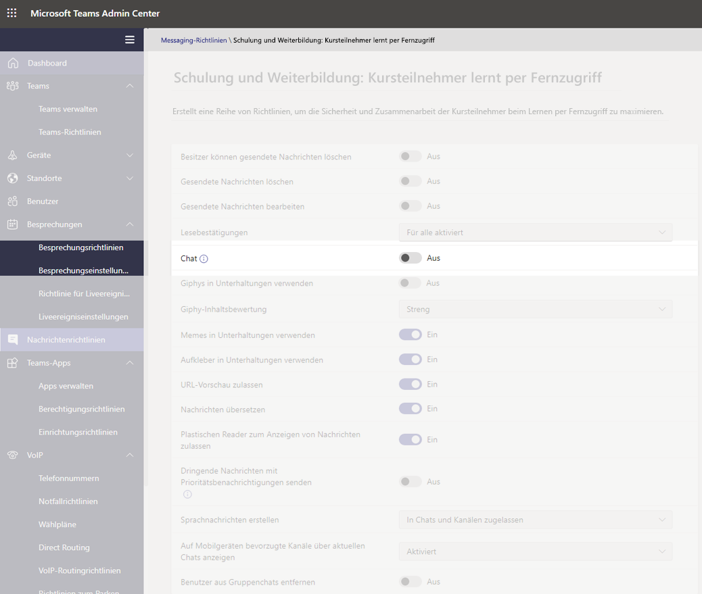
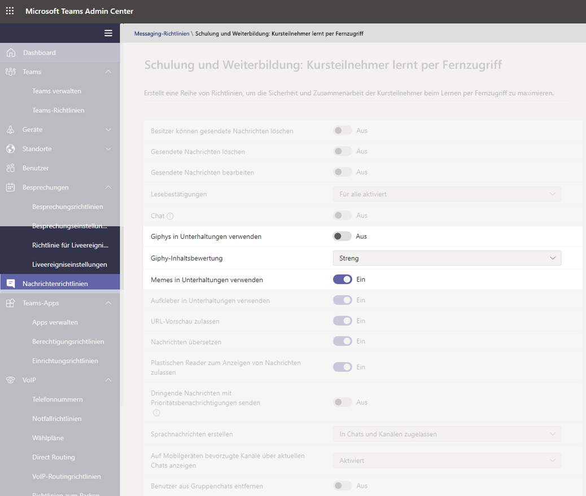
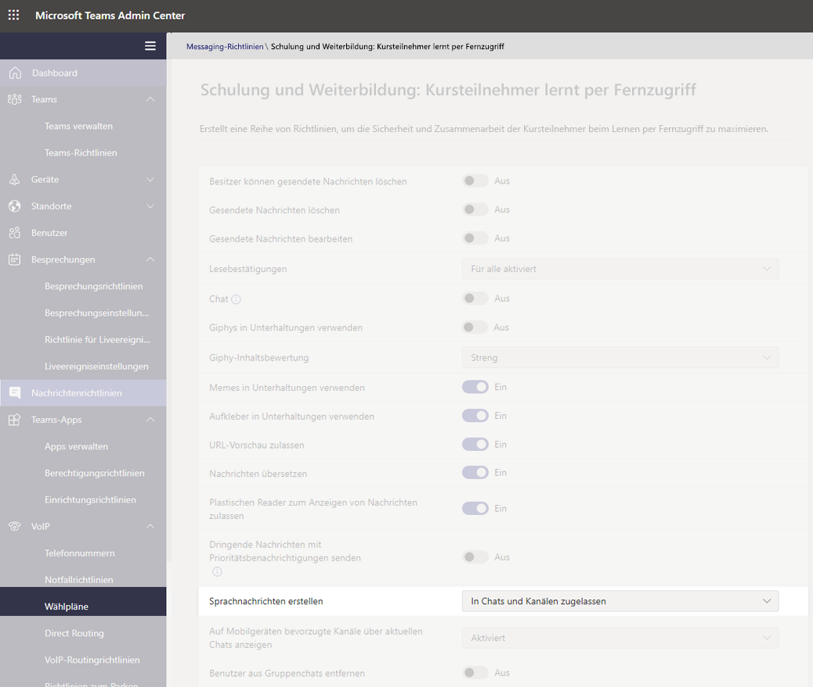
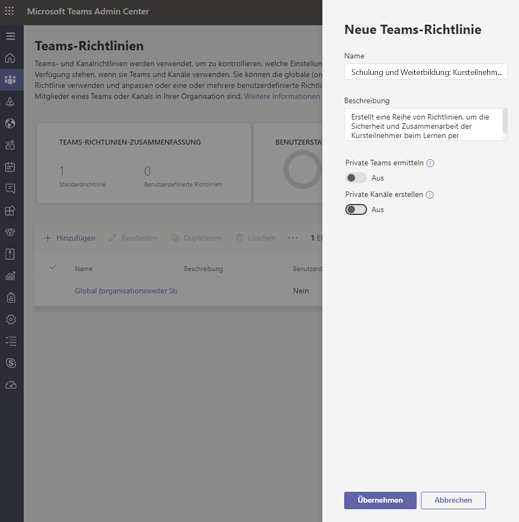
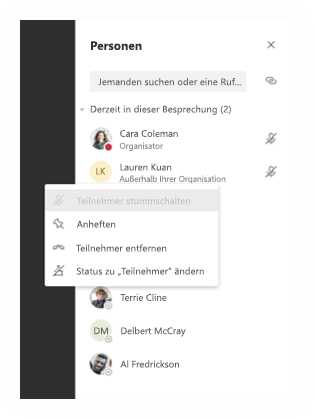

# Teams-Richtlinien und -Richtlinienpakete für Bildungseinrichtungen

> [!NOTE]
> Wenn Sie generell mehr über Richtlinien in Microsoft Teams erfahren möchten, lesen Sie [Zuweisen von Richtlinien zu Ihren Benutzern in Microsoft Teams](assign-policies.md).

Es ist wichtig zu beachten, dass in diesem Artikel mehrere Möglichkeiten zum Zuweisen von Richtlinien zu Benutzern in Teams behandelt werden.

- Manuelles Zuweisen zu einzelnen Benutzern.
- Massenzuweisung an mehrere Benutzer mittels PowerShell.
- Zuweisen von Richtlinienpaketen zu einzelnen oder mehreren Benutzern.

Die Vor- und Nachteile dieser Vorgehensweisen hängen von den individuellen Bedürfnissen der jeweiligen Institutionen ab.

## Administratoren: ersten Schritte mit der Microsoft Teams-Richtlinienverwaltung

In Microsoft Teams dreht sich alles darum, es Benutzern zu ermöglichen, an Besprechungen oder Live-Veranstaltungen teilzunehmen, zu chatten, Anrufe zu tätigen und Apps zu verwenden. Die Festlegung der richtigen Administratorrichtlinien für Microsoft Teams ist ein wichtiger Schritt zum Aufbau einer sicheren Lernumgebung für Schüler und Studenten in Teams. Als Administrator können Sie Richtlinien verwenden, um zu steuern, welche Teams-Funktionen für die Benutzer in Ihrem Bildungsinstitut verfügbar sind.

Hier eine Liste der Richtlinienbereiche, die in Microsoft Teams verfügbar sind:

- Besprechungen
- Liveereignisse
- Anrufe
- Messaging
- Teams
- App-Berechtigungen

:::image type="content" source="media/edu-admin-center-users.png" alt-text="Screenshot eines Benutzers mit angewendeten Richtlinien.":::

Sie können alle Teams-Richtlinien auf einfache Weise im [Microsoft Teams Admin Center](https://admin.teams.microsoft.com) verwalten, indem Sie sich mit Ihren Administratoranmeldeinformationen anmelden.

### Wo Sie die Microsoft Teams-Richtlinien finden

Sobald Sie sich beim Teams Admin Center angemeldet haben, können Sie zu den Richtlinieneinstellungen für alle Bereiche von Teams wechseln, die Sie verwalten müssen. Klicken Sie dazu in der linken Navigationsleiste des Teams Admin Center auf die Richtlinienoption. Wir haben einen Screenshot des Speicherortes der Messagingrichtlinien hinzugefügt.

:::image type="content" source="media/edu-messaging-policies.png" alt-text="Speicherort der Messaging-Richtlinie im Admin Center von Teams.":::

### Erstellen und Aktualisieren einer Richtliniendefinition

Bevor Sie Ihren Benutzern Richtlinien zuweisen, müssen Sie zuerst Ihre Richtliniendefinitionen für jeden Fähigkeitenbereich von Teams hinzufügen und erstellen.

> [!NOTE]
> Wir empfehlen, dass Sie für Ihre Schüler/Studenten und Lehrkräfte unterschiedliche Richtliniendefinitionen festlegen.

Standardmäßig wird jedem neuen Benutzer (Kursteilnehmer oder Lehrkraft) die globale Richtlinie (standardmäßig) für jeden Fähigkeitenbereich zugewiesen. Es wird empfohlen, diese Schritte auszuführen:

1. Erstellen Sie für jeden Teams-Fähigkeitenbereich eine benutzerdefinierte Richtliniendefinition, die dann Ihren Lehrkräften zugewiesen werden kann (ohne dies werden alle Änderungen, die Sie an der globalen Richtlinie vornehmen, die Lehrkräfte so lange einschränken, bis sie über eine eigene Richtlinie verfügen).
1. Weisen Sie Ihre Lehrkräfte dieser neuen Richtliniendefinition zu.
1. Aktualisieren Sie die globale (d.h. organisationsweite Standard-)Richtliniendefinition und weisen Sie diese dann Ihren Schülern zu.

Um Richtliniendefinitionen zu erstellen oder zu bearbeiten, wechseln Sie zum Richtlinien-Fähigkeitsbereich, in dem Sie arbeiten möchten (z. B. Messagingrichtlinien). Wählen Sie **Hinzufügen** aus, wenn Sie eine neue benutzerdefinierte Richtliniendefinition erstellen möchten (was Sie für die benutzerdefinierte Richtliniendefinition für Ihre Lehrkräfte tun werden). Andernfalls wählen Sie zum Ändern einer vorhandenen Richtliniendefinition **Bearbeiten** aus (dies ist die richtige Vorgehensweise, wenn Sie die globale Richtlinie für Schüler/Studenten aktualisieren).

:::image type="content" source="media/edu-messaging-policies-add-closeup.png" alt-text="Nahaufnahme des Abschnittes mit den Messagingrichtlinien und der Schaltfläche „Hinzufügen“.":::

Unabhängig davon, ob Sie eine Richtliniendefinition hinzufügen oder bearbeiten, werden Sie zu einer Übersicht geführt, in der alle Richtlinienoptionen aufgelistet sind, die mit diesem Richtlinienbereich zu tun haben. Verwenden Sie diese Liste, um auszuwählen, welche Werte Sie in Ihrer Richtliniendefinition festlegen möchten.

> [!IMPORTANT]
> Vergessen Sie nicht, **Speichern** auszuwählen, bevor Sie die Seite verlassen.

### So weisen Sie einem Benutzer eine Richtliniendefinition zu

> [!NOTE]
> Beim Zuweisen einer Richtliniendefinition kann es eine Weile dauern, bis diese an alle Benutzer und Clients weitergegeben wird. Möglicherweise möchten Sie dies tun, wenn die Benutzerkonten erstmalig in Azure/M365 erstellt werden und immer wenn ein neuer Schüler der Bildungseinrichtung beitritt.

Nachdem Sie die Richtliniendefinition erstellt oder aktualisiert haben, können Sie sie einem Benutzer zuweisen, indem Sie **Benutzer verwalten** auf der Seite „Richtlinie“ auswählen, nach dem gewünschten Benutzer suchen und dann die Richtlinie anwenden.

Sie können einem Benutzer auch eine Richtlinie zuweisen, indem Sie zu „Benutzer“ navigieren, den Benutzer auswählen, für den Sie die Richtlinien aktualisieren möchten, dann „Richtlinien“ und schließlich „Bearbeiten“ auswählen. Dort können Sie die Richtliniendefinition auswählen, die Sie dem Benutzer für jeden Fähigkeitenbereich zuweisen möchten.

> [!IMPORTANT]
> Wenn Sie Teil einer großen Bildungseinrichtung sind, ist es möglicherweise schwierig, die Richtlinien für jeden einzelnen Benutzer im Microsoft Teams Admin Portal festzulegen. Es empfiehlt sich dann, Richtlinien per Massenzuweisung in PowerShell zu verarbeiten. Wir haben einige, für Bildungseinrichtungen spezifische, Informationen dazu, wie Sie [einer großen Gruppe von Benutzern in Ihrer Bildungseinrichtung Richtlinien zuweisen](batch-policy-assignment-edu.md), falls Sie diese benötigen, und Sie können auch den nachstehenden Abschnitt zu Richtlinienpaketen lesen, die eine weitere großartige Möglichkeit zum Verwalten von Richtlinien und Einstellungen für große Benutzergruppen sind.

### Richtlinienpakete in Microsoft Teams

Ein Richtlinienpaket in Teams kombiniert vordefinierte Richtlinien und Richtlinieneinstellungen, die Sie über die oben beschriebenen Vorgehensweisen kennengelernt haben, und weist sie Benutzern mit ähnlichen Rollen in Ihrer Einrichtung zu. Richtlinienpakete vereinfachen und rationalisieren Richtlinien und lassen Sie diese konsistent verwalten. Üblicherweise weisen Sie jedem Ihrer Benutzer ein Richtlinienpaket zu und definieren die Richtlinien in jedem Paket entsprechend der Anforderungen dieser Benutzergruppe neu. Wenn Sie die Einstellungen in einem Paket aktualisieren, werden diese Einstellungen für alle Benutzer, denen dieses Paket zugeordnet ist, geändert.

Bildungseinrichtungen im Allgemeinen haben viele Benutzer mit individuellen Bedürfnissen, je nach Alter und Reife der Schüler. So möchten Sie beispielsweise Lehrkräften und Mitarbeitern Vollzugriff auf Microsoft Teams gewähren, die Funktionen von Microsoft Teams aber einschränken, um eine sichere und fokussierte Lernumgebung für Schüler zu fördern. Sie können Richtlinienpakete verwenden, um die Einstellungen entsprechend der Anforderungen unterschiedlicher Kohorten in Ihrer Bildungseinrichtung anzupassen.

> [!NOTE]
> Weitere Informationen finden Sie unter [Richtlinienpakete in Microsoft Teams verwalten](manage-policy-packages.md), wo Sie auch eine Schritt-für-Schritt-Anleitung zum Zuweisen eines Pakets an einzelne Benutzer, zum Zuweisen von Paketen in großen Mengen an bis zu 5.000 Benutzer sowie zum Verwalten und Aktualisieren der Richtlinien finden, die mit jedem Paket verknüpft sind.

Ähnlich wie die Richtlinienliste weiter oben in diesem Artikel definieren Richtlinienpakete Richtlinien für:

- Besprechungen
- Liveereignisse
- Anrufe
- Messaging
- Teams
- App-Berechtigungen

Microsoft Teams umfasst derzeit die folgenden Richtlinienpakete:

|Paketname im Microsoft Teams Admin Center |Am besten geeignet für  |Beschreibung |
|:--- |:--- |:--- |
|**Education_Teacher**| Lehrkräfte und Mitarbeiter| Verwenden Sie diese Richtlinien und Richtlinieneinstellungen, um Lehrern und Mitarbeitern in Ihrer Organisation Vollzugriff auf Chats, Anrufe und Besprechungen über Microsoft Teams zu gewähren. |
|**Education_PrimaryStudent**| Schüler im Grundschulalter  | Jüngere Schüler im Grundschulalter innerhalb Ihrer Institution benötigen möglicherweise mehr Beschränkungen innerhalb von Microsoft Teams. Verwenden Sie diesen Richtliniensatz und diese Richtlinieneinstellungen, um Funktionen wie die Erstellung und Verwaltung von Besprechungen, die Chatverwaltung und private Anrufe einzuschränken. |
|**Education_SecondaryStudent**| Schüler in der Altersgruppe weiterführender Schulen | Schüler in der Altersgruppe weiterführender Schulen innerhalb Ihrer Institution benötigen möglicherweise mehr Beschränkungen innerhalb von Microsoft Teams. Verwenden Sie diesen Richtliniensatz und diese Richtlinieneinstellungen, um Funktionen wie die Erstellung und Verwaltung von Besprechungen, die Chatverwaltung und private Anrufe einzuschränken. |
|**Education_HigherEducationStudent**| Hochschul-Studenten | Hochschul-Studenten innerhalb Ihrer Intuition benötigen möglicherweise weniger Einschränkungen als jüngere Schüler, aber einige Begrenzungen könnten dennoch angeraten sein. Sie können diesen Richtliniensatz und diese Richtlinieneinstellungen verwenden, um den Zugriff auf Chats, Anrufe und Besprechungen innerhalb Ihrer Organisation zu gewähren, aber einschränken, wie Ihre Schüler Microsoft Teams mit externen Teilnehmern verwenden. |
|||

:::image type="content" source="media/edu-policy-packages-list.png" alt-text="Seite „Richtlinienpakete“ mit einer Liste von Richtlinienpaketen zur Auswahl.":::

Jeder einzelnen Richtlinie wird der Name des Richtlinienpakets zugewiesen, damit Sie mit einem Richtlinienpaket verknüpfte Richtlinien leicht erkennen können. Wenn Sie das Richtlinienpaket „Education_Teacher“ beispielsweise Lehrkräften in Ihrer Bildungseinrichtung zuweisen, wird für jede Richtlinie im Paket eine Richtlinie namens „Education_Teacher“ erstellt.

> [!NOTE]
> Wenn Sie beschließen, dass Lehrkräfte und administrative Mitarbeiter unterschiedliche Richtlinien benötigen, können Sie ein vorhandenes Paket neu verwenden: ermitteln Sie ein Paket, das Sie derzeit nicht verwenden, und ändern Sie die Einstellungen so, dass sie für diese Gruppe geeignet sind. Möglicherweise müssen Sie eine Notiz für sich selbst erstellen, welcher Gruppe welches Paket zugeordnet ist, doch das ist der einzige „Nachteil“ der Neunutzung eines Pakets.

## Richtlinien, die zum Schutz von Schülern und Studenten zugewiesen werden sollten

### Besprechungsrichtlinien

#### Deaktivieren der Möglichkeit zum Erstellen und Starten von Besprechungen

Wenn Sie sicherstellen möchten, dass Schüler keine Besprechung planen können, um unbeaufsichtigt zu kommunizieren, stellen Sie die Funktion zur Erstellung einer Besprechung in den Besprechungsrichtlinien **Aus**:

- **Sofortbesprechungen in Kanälen zulassen**: Aus
- **Outlook-Add-In zulassen**: Aus
- **Planung von Kanalbesprechungen zulassen**: Aus
- **Planung privater Besprechungen zulassen**: Aus

- Und auf der gleichen Seite im Abschnitt Teilnehmer und Gäste in Besprechung: **Sofortbesprechungen in privaten Besprechungen zulassen**: Aus

#### Steuern Sie, ob Kursteilnehmer ihre Videos während Anrufen und Besprechungen freigeben können

Stellen Sie sicher, dass die Werte für Audio- und Visuelle Inhalte, die Sie für die Kursteilnehmer festlegen, im Abschnitt Besprechungsrichtlinien den Richtlinien Ihrer Bildungseinrichtung sowie den Wünschen von Schülern/Studenten, Lehrkräften und Eltern und Erziehungsberechtigten entsprechen (mit Ausnahme von **Cloud-Aufzeichnung zulassen**, von der wir empfehlen, sie auf **Aus** festzulegen).

Dies sind die Optionen:

- **Transkription zulassen**: Aus/An
- **Cloud-Aufnahme zulassen**:**Aus**
- **IP-Video zulassen**: Aus/An

:::image type="content" source="media/edu-policy-list-b.png" alt-text="Schüler einer Bildungseinrichtung in Remote-Learning-Umgebung, die Seite mit den Videooptionen wird angezeigt.":::

### Richtlinien für Live-Ereignisse

#### Deaktivieren der Möglichkeit zum Erstellen und Starten von Liveereignissen

Wenn Sie sicherstellen möchten, dass die Schüler nicht in der Lage sind, ein Liveereignis zur unbeaufsichtigten Kommunikation zu planen, deaktivieren Sie die Richtlinie **Planen zulassen** für Schüler und Studenten, indem Sie sie auf den Wert **Aus** festlegen.

:::image type="content" source="media/edu-allow-scheduling-off.png" alt-text="Schüler einer Bildungseinrichtung in Remote-Learning-Umgebung, die Option zum Zulassen der Planung ist ausgeschaltet.":::

### Anrufpläne

#### Deaktivieren der Möglichkeit, private Anrufe zu tätigen

Um sicherzustellen, dass Schüler keine privaten Gespräche mit anderen Schülern oder Lehrkräften tätigen können, deaktivieren Sie die Richtlinie **private Anrufe** für Schüler und Studenten, indem Sie sie auf **Aus** festlegen.

:::image type="content" source="media/edu-private-calls-off.png" alt-text="Schüler einer Bildungseinrichtung in Remote-Learning-Umgebung, private Anrufe sind deaktiviert.":::

### Messagingrichtlinien

#### Deaktivieren der Möglichkeit zum Löschen oder Bearbeiten von gesendeten Nachrichten

- Für Schüler/Studenten: um sicherzustellen, dass die von Schülern gesendeten Nachrichten nicht gelöscht oder geändert werden, sollte diese Einstellung für Schüler **deaktiviert** werden:
  - **Gesendete Nachrichten löschen**
  - **Gesendete Nachrichten bearbeiten**
- Für Lehrkräfte: um sicherzustellen, dass Lehrkräfte unangemessene Nachrichten, die von Schülern gesendet werden, moderieren oder löschen können, sollte diese Einstellung für Lehrkräfte **aktiviert** werden:
  - **Besitzer können gesendete Nachrichten löschen** (diese Einstellung ermöglicht es Lehrkräften, unangemessene Schülernachrichten zu löschen)
  - **Gesendete Nachrichten löschen**
  - **Gesendete Nachrichten bearbeiten**

> [!NOTE]
> Weitere Informationen zu diesem Thema finden Sie unter [Stummschalten von Schülerkommentaren in einem Klassenteam](https://support.office.com/article/Mute-student-comments-in-a-class-team-a378de16-ffc0-420c-b08d-e17ec08e7c17).

#### Steuern, ob Kursteilnehmer privat chatten können

Stellen Sie sicher, dass der von Ihnen festgelegte Wert für **Chat ein/aus** den Richtlinien Ihrer Bildungseinrichtung sowie den Wünschen von Kursteilnehmern und Lehrkräften entspricht. Dieses Steuerelement aktiviert oder deaktiviert die Möglichkeit, dass Benutzer im 1:1-Chat oder Gruppenchat in Teams privat kommunizieren.

#### Steuern, ob Schüler und Studenten ihre Nachrichten personalisieren können

Stellen Sie sicher, dass der von Ihnen für die Schüler festgelegte Wert den Richtlinien Ihrer Bildungseinrichtung sowie den Wünschen von Schülern, Lehrkräften, Eltern und Erziehungsberechtigten entspricht. Wir empfehlen, **Giphy für Schüler** auf **Aus** festzulegen, und **Memes und Sticker** auf **An** festzulegen.

#### Steuern, ob Kursteilnehmer Sprachnachrichten senden können

Stellen Sie sicher, dass der von Ihnen festgelegte Wert für **Sprachnachrichten erstellen** den Richtlinien Ihrer Bildungseinrichtung sowie den Wünschen von Kursteilnehmern und Lehrkräften entspricht.

#### Deaktivieren der Möglichkeit zum Entfernen von Benutzern aus dem Chat für Schüler/Studenten

Die Schüler/Studenten sollten nicht in der Lage sein, andere Benutzer aus Chats zu entfernen, in denen sie mitwirken. Die Einstellung für **Entfernen von Benutzern aus Gruppenchats** sollte auf **Aus** festgelegt sein.

### Teams-Richtlinien

#### Deaktivieren der Möglichkeit, private Kanäle zu suchen und zu erstellen

Wenn Sie sicherstellen möchten, dass die Kursteilnehmer keinen privaten Kanal als persönlichen Bereich erstellen können, in dem Kommunikation ohne Aufsicht stattfinden kann, legen Sie die Richtlinie **Erstellen eines privaten Kanals** für Schüler und Studenten auf **Aus** fest.

> [!IMPORTANT]
> Wahrscheinlich möchten Sie auch sicherstellen, dass die Kursteilnehmer nicht in der Lage sind, neue Teams in Microsoft Teams zu erstellen. Hierbei handelt es sich eigentlich um eine M365-Gruppeneinstellung, weitere Informationen dazu finden Sie [hier](https://docs.microsoft.com/microsoft-365/admin/create-groups/manage-creation-of-groups).

### App-Berechtigungsrichtlinien

#### Steuern, ob Kursteilnehmer innerhalb von Teams Apps hinzufügen können

Vergewissern Sie sich, dass die von Ihnen festgelegten Werte den Richtlinien Ihrer Bildungseinrichtung entsprechen. Wenn Sie beispielsweise möchten, dass die Kursteilnehmer die von Ihnen genehmigten Apps erhalten, können Sie Folgendes auswählen:

- **Microsoft Apps**: **Alle Apps zulassen**
- **Apps von Drittanbietern**: **bestimmte Apps zulassen und alle anderen blockieren**
- **Für Mandanten-Apps**: **bestimmte Apps zulassen und alle anderen blockieren**

:::image type="content" source="media/edu-policies-apps.png" alt-text="Schüler einer Bildungseinrichtung in Remote-Learning-Umgebung, mit eingestellten App-Richtlinienoptionen.":::

> [!NOTE]
> Dies ist ein Beispiel, und wie oben erwähnt, sollten Sie diese Richtlinien gemäß den Richtlinien Ihrer Bildungseinrichtung festlegen.

## Richtlinien, die für Lehrkräfte zugewiesen werden sollten

Dies sind die empfohlenen Richtlinieneinstellungen, die Administratoren für Lehrkräfte konfigurieren sollten, damit sie eine sichere Lernumgebung für ihre Schüler bieten können.

> [!NOTE]
> Die Richtlinienempfehlungen für Schüler/Studenten enthalten mehr Informationen als der Abschnitt für Lehrkräfte, der nachstehend aufgeführt ist. Während Sie Richtlinieneinstellungen in Übereinstimmung mit den Richtlinien und Verfahren für das Bildungsinstitut festlegen können, sind die hier aufgeführten Empfehlungen in Bezug auf die Sicherheit der Kursteilnehmer strikt relevant.

### Besprechungsrichtlinien

Diese Einstellungen ermöglichen Lehrkräften die Steuerung des Zugangs zu ihren Besprechungen.

- **Anonymen Personen das Starten einer Besprechung gestatten**: **Aus**
- **Personen automatisch zulassen**:**Jeder in Ihrer Organisation**
- **Einwählbenutzern das Umgehen des Wartebereichs gestatten**: **Aus**

### Nachrichtenrichtlinien

Wenn Sie **Besitzer können gesendete Nachrichten löschen** auf **An** festlegen, können Lehrkräfte Chatsitzungen überwachen und unangemessene Nachrichten in Kanal-Besprechungen löschen.

> [!NOTE]
> Auf diese Weise können Lehrkräfte anstößige Nachrichten aus Klassenchats entfernen, wenn die Besprechung innerhalb des Kanals erstellt wird, oder Nachrichten innerhalb des Kanals selbst entfernen.

## Was Lehrkräfte zum Schutz von Schülern tun können

Während das Festlegen von Richtlinien eine hervorragende Möglichkeit für Administratoren ist, Schüler und Studenten in einer Teams-Umgebung proaktiv zu schützen, sind Lehrkräfte die Personen, die in regelmäßigen Abständen mit den Schülern zusammenarbeiten, und auch sie spielen eine wichtige Rolle, um die Sicherheit der Kursteilnehmer zu gewährleisten. Administratoren sollten mit den Lehrkräften, mit denen sie zusammenarbeiten, die folgenden Informationen besprechen.

### Festlegen von Besprechungsrollen über Ihre Besprechungsoptionen

Über Besprechungsoptionen können Sie steuern, ob Besprechungsteilnehmer als Teilnehmer oder Referenten an Besprechungen teilnehmen sollen. Sie haben nun die folgenden Optionen:

- Wechseln Sie zu Ihrem **Kalender**, und navigieren Sie zu der Besprechung, die Sie aktualisieren möchten. Klicken oder tippen Sie in der Nähe des Links zum Beitreten zur Besprechung auf **Besprechungsoptionen**, um Ihre **Besprechungsoptionen** zu öffnen.

- Mit der Auswahl **Wer kann die Lobby umgehen** können Sie steuern, wer der Besprechung direkt beitreten können soll. Legen Sie dies auf **Personen in meiner Organisation** fest, um externen Benutzern keine Möglichkeit zu bieten, direkt beizutreten und legen Sie **Anrufer immer die Lobby umgehen lassen** auf **Aus** fest, damit Teilnehmer zur Besprechung zugelassen werden müssen, anstatt direkt beizutreten. Sie haben auch die Möglichkeit **den Beitritt oder das Verlassen von Anrufern ankündigen zu lassen** und diese Option sollte auf **An** festgelegt werden, damit Sie immer wissen, wer sich in der Besprechung befindet.
- Steuern, wer der Besprechung als Referent oder Teilnehmer beitritt. Sie können **Nur ich** auswählen, um alle anderen Teilnehmer als bloße Teilnehmer festzulegen. Dies ist die sicherste Einrichtung für Besprechungen in der Form einer Klassenzimmer-Situation.
  - Wenn Sie davon ausgehen, dass in Ihrer Besprechung mehrere Referenten anwesend sein werden, wählen Sie **bestimmte Personen** aus und wählen Sie die anderen Teilnehmer aus, die als Referenten beitreten sollen. Wählen Sie **Jeder** aus, wenn alle Teilnehmer als Referenten an der Besprechung teilnehmen sollen.

:::image type="content" source="media/edu-meeting-options.png" alt-text="Dropdownfeld „Wer kann die Lobby umgehen“, „Personen in meiner Organisation“ ist ausgewählt und Dropdownfeld „Wer kann präsentieren“ mit „Nur ich“ ausgewählt.":::

### Rollen in einer Onlinebesprechung

Jedem Teilnehmer an einer Besprechung wird eine Rolle als Referent oder Teilnehmer zugewiesen. Über die Rolle eines Teilnehmers wird definiert, was die Person in einer Besprechung tun kann. Sehen Sie sich die nachstehende Tabelle an.

|Funktionen  |Organisator/Referent  |Teilnehmer  |
|---------|---------|---------|
|Sprechen Sie und geben Sie Ihr Video frei     |     J     |     J     |
|Nehmen Sie am Besprechung-Chat teil     |     J     |     J     |
|Privates Anzeiges einer PowerPoint-Datei, die von einer anderen Person freigegeben wurde.     |     J     |     J     |
|Inhalte freigeben     |     J     |     N     |
|Andere Teilnehmer stumm schalten|     J     |     N     |
|Teilnehmer entfernen      |     J     |     N     |
|Teilnehmer aus der Lobby zulassen|     J     |     N     |
|Die Rollen anderer Teilnehmer ändern     |     J     |     N     |
|Aufnahme starten oder stoppen     |     J     |     N     |

### Rollen während einer Besprechung ändern

Jedem Teilnehmer an einer Besprechung wird eine Rolle als Referent oder Teilnehmer zugewiesen. Über die Rolle eines Teilnehmers wird definiert, was die Person während einer Besprechung tun kann.

- Wenn Sie die Rolle eines Teilnehmers ändern möchten, klicken oder tippen Sie auf **Teilnehmer anzeigen** in Ihren Anrufsteuerelementen. Klicken Sie mit der rechten Maustaste auf den Teilnehmer, dessen Rolle geändert werden muss, und wählen Sie dann **Status zu „Teilnehmer“ ändern** oder **Status zu „Referent“ ändern** aus.

- Wenn Sie schnell auf Ihre Besprechungsoptionen zugreifen und die Einstellungen für die Besprechungsrolle sowohl für aktuelle Teilnehmer als auch für jeden, der zukünftig an Ihrer Besprechung teilnimmt, ändern möchten, klicken oder tippen Sie auf **weitere Aktionen** in Ihren Anrufsteuerelementen, und dann auf **Besprechungsdetails anzeigen**. Den Link zu Ihren **Besprechungsoptionen ** finden Sie neben dem Link der Besprechung.

:::image type="content" source="media/edu-meeting-details.png" alt-text="Besprechungsfenster mit dem Bereich „Besprechungsdetails“ auf der rechten Seite.":::

### Stummschalten der Kommentare von Kursteilnehmern

Nach der Besprechung können Sie blockieren, dass Schüler weiterhin kommentieren, falls Sie eine Kanalbesprechung geplant hatten.

#### Für eine bestimmte Besprechung

Wenn Sie eine Besprechung in einem Kanal planen, ist die Besprechung selbst ein Kanalbeitrag, und die Besprechungs-Chats sind Replikate des Beitrags. Als Teambesitzer können Sie auf **weitere Aktionen** für diesen Beitrag klicken oder tippen und dann **Bearbeiten** auswählen.

:::image type="content" source="media/edu-meeting-edit.png" alt-text="Wenn Sie „weitere Optionen“ für einen Kanalbeitrag auswählen und die Menüoption „Bearbeiten“ als zweite Option im Popupmenü sehen, wird dies angezeigt.":::

Im Bereich „Bearbeiten“ finden Sie ein Dropdownmenü, mit dem Sie festlegen können, dass die Option **Sie und die Moderatoren können antworten** gelten soll.

### Für alle Besprechungen und Beiträge eines Teams

Sie können steuern, wann Schüler im Klassenteam und in Besprechungschats posten und antworten können. Klicken oder tippen Sie auf **weitere Aktionen** des Teams, klicken Sie auf **Team verwalten**, wechseln Sie zu **Mitglieder** und wählen Sie dann Personen aus, um einzelne Schüler stummzuschalten oder **alle Schüler stummzuschalten**.

## Weitere Informationen

Informieren Sie sich unter [Schutz von Schülern bei der Verwendung von Teams für den Fernunterricht](https://support.office.com/article/keeping-students-safe-while-using-meetings-in-teams-for-distance-learning-f00fa399-0473-4d31-ab72-644c137e11c8), um weitere Informationen zum Schutz Ihrer Schüler zu erhalten.
