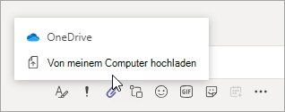
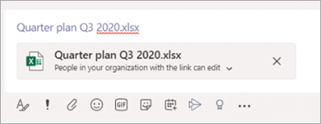

# Freigeben von Dateien in Microsoft Teams

In Microsoft Teams können Benutzer Inhalte für andere Teams-Benutzer innerhalb und außerhalb ihrer Organisation freigeben. Die Freigabe in Teams basiert auf den Einstellungen, die in SharePoint und OneDrive konfiguriert sind. Die Einstellungen, die Sie für SharePoint und OneDrive festlegen, steuern also auch die Freigabe in Teams.

## Übersicht

Benutzer können Dateien von OneDrive, von Teams und Websites, auf die sie Zugriff haben, und von ihrem Computer aus freigeben. Um eine Datei freizugeben, können Benutzer die folgenden Schritte ausführen:

- Klicken Sie in einem Kanal auf **Anfügen** (das Büroklammer-Symbol), wählen Sie **Zuletzt verwendet**, **Teams und Kanäle durchsuchen**, **OneDrive** oder **Von meinem Computer hochladen** und dann die Datei aus, die sie freigeben möchten.   
    
- Klicken Sie in einem Chat auf **Anfügen** (das Büroklammer-Symbol), wählen Sie **OneDrive** oder **Von meinem Computer hochladen** und dann die Datei aus, die sie freigeben möchten.  
    
- Kopieren Sie den Freigabelink, und fügen Sie ihn in das Feld „Verfassen“ ein. 
    

### Was Sie über die Dateifreigabe wissen müssen

### Berechtigungen für freigegebene Dateien und Freigabelinks

Wenn Benutzer eine Datei freigeben, indem sie sie in OneDrive oder in Teams und Kanälen aufrufen, wird allen Empfängern der Zugriff mit der [auf Organisationsebene festgelegten Standardberechtigung](https://docs.microsoft.com/sharepoint/change-default-sharing-link) gewährt.

Wenn ein Benutzer einen Freigabelink kopiert und einfügt, werden die für diesen Freigabelink festgelegten Berechtigungen beachtet, und die SharePoint-URL wird auf den Dateinamen verkürzt. Mit anderen Worten: Teams verwendet nur den Dateinamen, um die Verknüpfung zu einer Datei herzustellen.

Wenn Benutzer eine Datei aus Teams heraus freigeben, können sie genau wie in Microsoft 365 festlegen, wer auf die Datei zugreifen darf. Sie können jedem, Personen in Ihrer Organisation, Personen mit bestehendem Zugriff oder bestimmten Personen (zu denen auch die Personen in einem 1:1-Chat, Gruppenchat oder Kanal gehören können) Zugriff gewähren.  Wenn eine Datei freigegeben wird, ist die Dateivorschau in der Nachricht verfügbar, zusammen mit allen Dateiaktionen wie **Online öffnen**, **Herunterladen** und **Link kopieren**. Standardmäßig wird die Datei in Teams geöffnet. Manchmal kann es vorkommen, dass der Freigabelink noch nicht in eine Dateivorschau umgewandelt wurde, wenn ein Benutzer die Nachricht sendet. Die Dateivorschau wird vom System generiert, aber in diesem Szenario wird der Freigabelink nicht auf den reinen Dateinamen gekürzt.

Wenn Benutzer eine Datei in einem Chat oder Kanal freigeben, werden sie benachrichtigt, wenn einzelne oder alle Empfänger keine Berechtigung zum Anzeigen der Datei haben. Sie können die Berechtigungen für die Datei vor der Freigabe ändern, indem sie auf den Pfeil neben der Dateivorschau klicken, der nun in der Nachricht angezeigt wird.

### Kopieren eines Freigabelinks in Teams

Benutzer können einen SharePoint-Freigabelink kopieren und Freigabeberechtigungen ändern, genau wie in Microsoft 365. Sie können jedem, Personen in Ihrer Organisation, Personen mit bestehendem Zugriff oder bestimmten Personen Zugriff gewähren. Die Standardberechtigung des Links entspricht der auf Organisationsebene festgelegten Standardberechtigung, es sei denn, die Berechtigungen auf SharePoint-Webseitenebene setzen diese außer Kraft.

## Konfigurieren der Freigabe in OneDrive und SharePoint

Weitere Informationen zur Freigabe von Dateien in OneDrive und SharePoint, einschließlich Konfiguration der Freigabe und Aktivierung/Deaktivierung der Freigabe, finden Sie unter:

- [Externe Freigabe – Übersicht](https://docs.microsoft.com/sharepoint/external-sharing-overview) – Beschreibt, was bei Benutzerfreigaben geschieht, und zwar abhängig davon, was freigegeben wird und für wen die Freigabe erfolgt.

- [Verwalten von Freigabeeinstellungen](https://docs.microsoft.com/sharepoint/turn-external-sharing-on-or-off) – Beschreibt, wie globale und SharePoint-Administratoren ihre Freigabeeinstellungen für SharePoint und OneDrive auf Unternehmensebene ändern können.

- [Aktivieren oder Deaktivieren der externen Freigabe für eine Website](https://docs.microsoft.com/sharepoint/change-external-sharing-site) – Beschreibt, wie globale und SharePoint-Administratoren die externe Freigabe für eine Website aktivieren oder deaktivieren können.

- [Ändern des Standard-Linktyps für eine Website](https://docs.microsoft.com/sharepoint/change-default-sharing-link) – Beschreibt, wie Sie den Standardlinktyp festlegen, um ihn restriktiver zu machen.

## Weitere Informationen

- [Interaktion von SharePoint Online und OneDrive for Business mit Microsoft Teams](sharepoint-onedrive-interact.md)

- [SharePoint und Teams: ein starkes Team](https://techcommunity.microsoft.com/t5/Microsoft-SharePoint-Blog/SharePoint-and-Teams-Better-Together/ba-p/189593)

- [Freigeben von OneDrive-Dateien und -Ordnern](https://support.office.com/article/Share-OneDrive-files-and-folders-9fcc2f7d-de0c-4cec-93b0-a82024800c07#OS_Type=OneDrive_-_Business)

- [Freigeben von SharePoint-Dateien oder -Ordnern](https://support.office.com/article/share-sharepoint-files-or-folders-1fe37332-0f9a-4719-970e-d2578da4941c)
