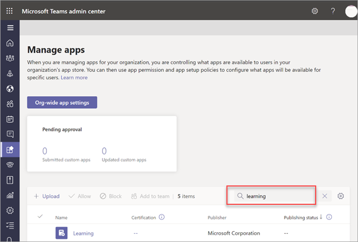
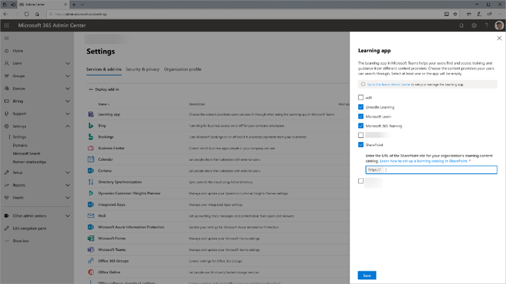
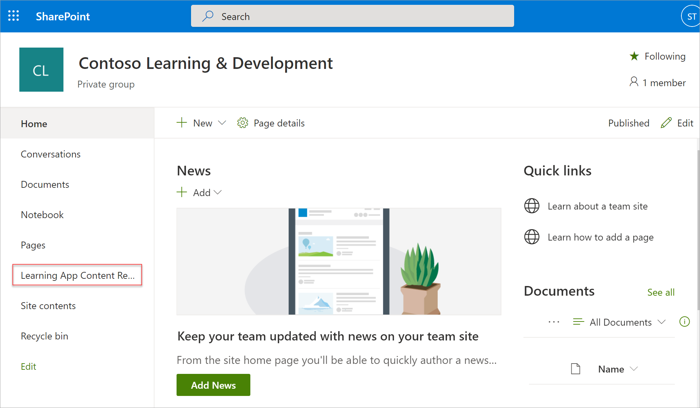
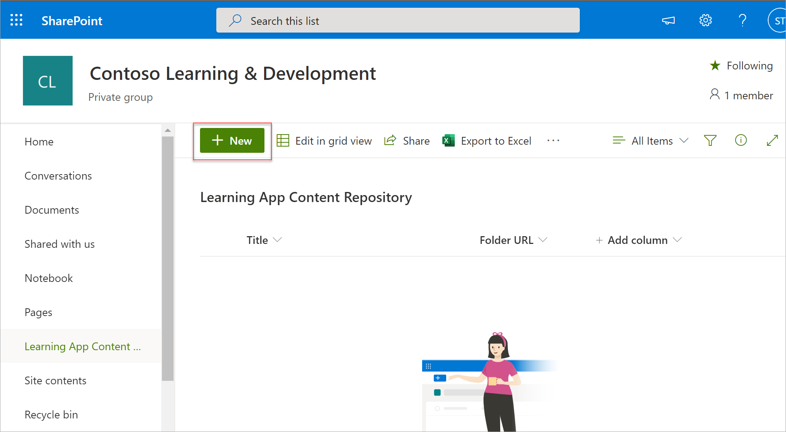
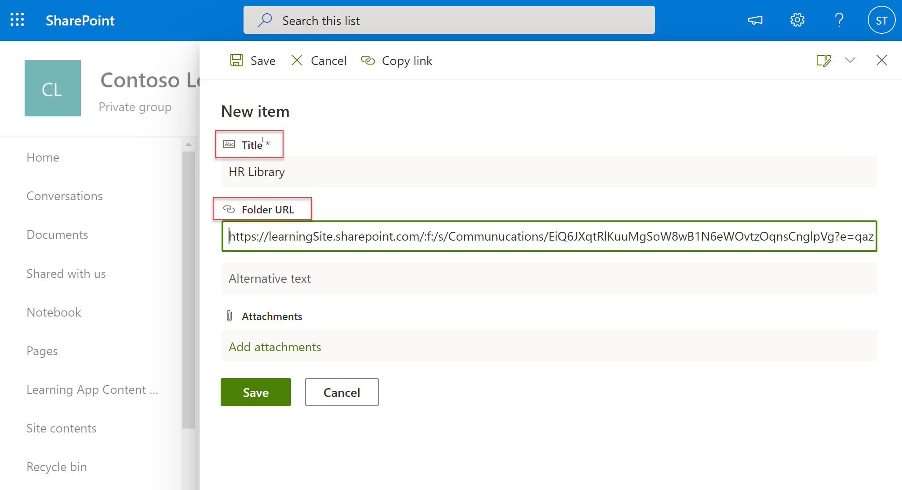

# Installieren, verwalten und Zuweisen von Berechtigungen für die Lern-App für Teams (private Preview)Install, manage, and assign permissions for the Teams Learning app (private preview)

*Dieser Artikel enthält vorläufige Inhalte für die Learning-App für Teams, die sich in der privaten Vorschau befindet.**This article contains preliminary content for the Teams Learning app, which is in private preview.*

Die Microsoft Teams Learning-app (private Preview) befähigt Teams und Einzelpersonen in Ihrer Organisation, das Lernen zu einem natürlichen Teil Ihres Tages zu machen.The Microsoft Teams Learning app (private preview) empowers teams and individuals in your organization to make learning a natural part of their day. Die App erstellt einen zentralen Hub in Teams, in dem Mitarbeiter Inhaltsbibliotheken in Ihrer Organisation freigeben, zuweisen und daraus lernen können.The app creates a central hub in Teams where employees can share, assign, and learn from content libraries across your organization. Administratoren setzen Berechtigungen und ermöglichen das Erlernen von Inhaltsquellen für die app.Admins set permissions and allow learning content sources for the app. Zu den Lerninhalten können LinkedIn Learning, Microsoft Learn, Microsoft 365-Schulungen, die in SharePoint Online gespeicherten Inhalte Ihrer Organisation sowie Drittanbieter gehören, die von der App unterstützt werden.Learning content can include LinkedIn Learning, Microsoft Learn, Microsoft 365 training, your organization's own content stored in SharePoint online, and third-party providers that are supported by the app.

Um die Lern-App für Teams einzurichten (private Preview), müssen Sie Folgendes einbeziehen:To set up the Teams Learning app (private preview), you'll need to involve:

-   Team Admin Center-AdministratorTeams admin center admin
-   Microsoft 365 Admin Center-Administrator (also ein globaler Administrator)Microsoft 365 admin center admin (that is, a global admin)
-   Wissens Administrator (eine neue Rolle im Microsoft 365 Admin Center, die ein globaler Administrator (auch bekannt als IT-Administrator oder Microsoft 365-Administrator) beliebigen Personen in der Organisation zuweisen kann.Knowledge admin (a new role in the Microsoft 365 admin center that a global admin (also known as IT admin or Microsoft 365 admin) can assign to anyone in the organization. Diese Rolle verwaltet die Lerninhalts Quellen der Organisation über das Microsoft 365 Admin Center.)This role manages the organization’s learning content sources through the Microsoft 365 admin center.) 

## Verwalten der Lern-App für Teams (private Preview) im Team Admin CenterManage the Teams Learning app (private preview) in the Teams admin center

Der Teamadministrator installiert die Lern-App für Teams (private Preview) aus dem App Store und wendet die Richtlinien für die APP-Einrichtung,-Verwaltung und-Berechtigungen über das Team Admin Center an.The Teams admin installs the Teams Learning app (private preview) from the app store and applies app setup, manage, and permissions policies through the Teams admin center.

### Verwalten der Lern-App für Teams (private Preview)Manage the Teams Learning app (private preview)

Führen Sie die folgenden Schritte aus, um die Einstellungen für die APP zu verwalten:To manage settings for app, follow these steps:

1. Navigieren Sie in der linken Navigationsleiste des Microsoft Teams Admin Center zu **Teams apps**  >  **Verwalten von apps**.In the left navigation of the Microsoft Teams admin center, go to **Teams apps** > **Manage apps**.

   

2. Geben Sie auf der Seite **apps verwalten** im Suchfeld den Text *Learning* ein, um nach der Lern-App für Teams zu suchen (private Preview).On the **Manage apps** page, in the search box, type *learning* to search for the Teams Learning app (private preview).

   

3. Auf der  Lernseite:On the **Learning** page:
   1. Wählen Sie unter **Status** die Option **erlaubt** aus, um die APP zu aktivieren.Under **Status**, select **Allowed** to turn on the app.
   2. Wechseln Sie auf der Registerkarte **Einstellungen** im Abschnitt **App-Einstellungen** zum Microsoft 365 Admin Center, um Lerninhalts Quellen zu konfigurieren.On the **Settings** tab, in the **App settings** section, go to the Microsoft 365 admin center to configure learning content sources.

   

4. Nachdem Sie die App-Einstellungen **verwaltet** haben, wechseln Sie zu **Berechtigungen und Einrichten von Richtlinien** , um Mitarbeitern, die Zugriff auf die APP haben sollen, als Teil der Teilnahme Ihrer Organisation an der privaten Vorschau die Berechtigung zu erteilen.After **Manage app** settings, go to **Permissions and Set-up policies** to grant permission to employees who should have access to the app as part of your organization's participation in the private preview.

> [!NOTE]
>  Wenn sich Ihre Organisation im Rahmen des Teams TAP100-Programms in Ring 4,0 befindet, müssen Sie möglicherweise die folgenden Schritte ausführen, um zugelassene Benutzer in Ring 3,0 für den Zugriff auf die Lern-App für Teams (private Preview) zu aktivieren.If your organization is in Ring 4.0 as part of Teams TAP100 program, you might need to do the following to enable approved users in Ring 3.0 to access the Teams Learning app (private preview).

Im Rahmen der privaten Vorschau wird die Lern-App für Teams (private Preview) in Ring 3,0 veröffentlicht.As part of private preview, the Teams Learning app (private preview) is released in Ring 3.0. Wenn sich Ihre Organisation in Ring 4,0 befindet, wird die APP nicht im App Store angezeigt.If your organization is in Ring 4.0, you won’t see the app in the app store. Um die APP zu testen, müssen Sie eine benutzerdefinierte Berechtigungsrichtlinie für Apps erstellen, diese so festlegen, **dass alle apps** zugelassen werden, und Sie den von 3,0 genehmigten Benutzern zuweisen.To test the app, you need to create a custom apps permission policy, set it to **Allow all apps**, and assign it to Ring 3.0 approved users.

   

## Konfigurieren von Lerninhalts Quellen im Microsoft 365 Admin CenterConfigure learning content sources in the Microsoft 365 admin center

Die Administratoren für das Microsoft 365 Admin Center – entweder alleine oder durch Zuweisen der Rolle des Wissens Administrators zu ausgewählten Personen in Ihrer Organisation – können Einstellungen verwalten, die sich auf die Lern-App für Teams (private Preview) beziehen, und können die Lerninhalts Quellen konfigurieren.The admins for the Microsoft 365 admin center—either by themselves or by assigning the Knowledge admin role to selected individuals in your organization—can manage settings related to the Teams Learning app (private preview) and can configure the learning content sources.

> [!TIP]
> Der Knowledge-Administrator sollte mittelmäßig technisch sein und über vorhandene SharePoint-Administratoranmeldeinformationen verfügen, vorzugsweise eine Person, die in der Bildungs-, Lern-, Schulungs-oder Mitarbeiter Erfahrung des Unternehmens gut vertraut ist.The Knowledge admin should be moderately technical and have existing SharePoint admin credentials, preferably someone who is well-versed in the education, learning, training, or employee experience part of the organization.
 
Der Administrator wählt aus, welche Lerninhalts Quellen (wie LinkedIn Learning oder SharePoint) in der app verfügbar sein sollen.The admin selects which learning content sources (such as LinkedIn Learning or SharePoint) will be available in the app. Der Administrator konfiguriert dann diese Quellen, um sicherzustellen, dass der Inhalt für die Suche und Ermittlung zur Verfügung steht, und kann von den Mitarbeitern durchsucht werden, die die APP verwenden.The admin then configures those sources to make sure the content is available for search and discovery and can be browsed by the employees who use the app.

### Zuweisen der Rolle des Wissens Administrators [optional]Assign the Knowledge admin role [Optional]

Diese Schritte müssen vom Administrator für das Microsoft 365 Admin Center ausgeführt werden.These steps are to be performed by the admin for the Microsoft 365 admin center.

1.  Wechseln Sie in der linken Navigationsleiste des Microsoft 365 Admin Center zu **Rollen**.In the left navigation of the Microsoft 365 admin center, go to **Roles**.

2.  Wählen Sie auf der Seite **Rollen** auf der Registerkarte **Azure AD** den Eintrag **Wissens Administrator** aus.On the **Roles** page, on the **Azure AD** tab, select **Knowledge admin**.
 
3.  Wählen Sie auf der Seite **Wissens Administrator** im Abschnitt **zugewiesene Administratoren** die Option **Hinzufügen** aus, und fügen Sie dann die für die Rolle ausgewählte Person hinzu.On the **Knowledge admin** page, in the **Assigned Admins** section, select **Add**, and then add the person you choose for the role.

### Konfigurieren von Einstellungen für die Lerninhalts Quellen für die APPConfigure settings for the learning content sources for the app

Diese Schritte müssen vom Microsoft 365-Administrator oder vom Knowledge-Administrator ausgeführt werden.These steps are to be performed by the Microsoft 365 admin or the Knowledge admin.

1.  Navigieren Sie in der linken Navigationsleiste des Microsoft 365 Admin Center zu **Einstellungen**  >  **org-Einstellungen**.In the left navigation of the Microsoft 365 admin center, go to **Settings** > **Org settings**.

2.  Wählen Sie auf der Seite " **Einstellungen** " auf der Registerkarte **Dienste & Add-ins** die Option **Lern-App** aus.On the **Settings** page, on the **Services & add-ins** tab, select **Learning app**.

   

3.  Wählen Sie im Lernprogramm- **App** -Panel die Lerninhalts Quellen aus, die Sie für die Organisation konfigurieren möchten, und wählen Sie dann **Speichern** aus.On the **Learning app** panel, select the learning content sources you want to configure for the organization, and then select **Save**.

   

Unter allen vorhandenen Lernquellen sind einige standardmäßig aktiviert.Among all the learning sources that exist, some will be enabled by default. Hierzu zählen folgende Punkte:These include:

- LinkedIn Learning (Kostenlose Inhalte)LinkedIn Learning (free content)
- Microsoft LearnMicrosoft Learn
- Microsoft 365-SchulungMicrosoft 365 Training

> [!NOTE]
> Wenn Ihre Organisation über ein LinkedIn Learning Standard-oder pro-Abonnement verfügt, wird das Inhalts-Repository für die Mitarbeiter in Ihrer Organisation freigegeben.If your organization has a LinkedIn Learning Standard or Pro subscription, the content repository will be unlocked for the employees in your organization. Nur Mitarbeiter, die über die Berechtigung verfügen, können das gesamte Inhalts-Repository verwenden.Only those employees who have permission will be able to use the entire content repository.

Andere Quellen müssen möglicherweise manuell aktiviert oder konfiguriert werden.Other sources might need to be enabled or configured manually. Lernquellen, die nicht von Microsoft stammen, sind separat zwischen Ihrer Organisation und dem Drittanbieter lizenziert.Learning sources that are not from Microsoft are separately licensed between your organization and the third party. Sie müssen sicherstellen, dass Sie sich für das Lernen für Sie und Ihre Benutzer angemeldet haben.You’ll need to verify you’ve signed up for their learning for you and your users.

Wenn Sie eine Lerninhalts Quelle aktivieren oder deaktivieren möchten, aktivieren Sie das Kontrollkästchen neben der Quelle.To enable or disable a learning content source, select the check box next to the source. Wenn eine Quelle aktiviert ist, wird ein Häkchen angezeigt.If a source is enabled, a check mark will be visible.

## Konfigurieren von SharePoint als Lerninhalts QuelleConfigure SharePoint as a learning content source

Sie konfigurieren SharePoint als Lerninhalts Quelle für die Lern-app "Teams" (private Preview) im Microsoft 365 Admin Center.You configure SharePoint as a learning content source for the Teams Learning app (private preview) in the Microsoft 365 admin center.

### ÜbersichtOverview

Der Knowledge-Administrator stellt eine Website-URL bereit, in der der Lerndienst ein leeres zentrales Learning Content-Repository in Form einer strukturierten SharePoint-Liste erstellen kann.The Knowledge admin provides a site URL to where the Learning Service can create an empty centralized learning content repository in the form of a structured SharePoint list. Diese Liste kann von der Organisation verwendet werden, um Links zu unternehmensübergreifenden SharePoint-Ordnern mit Lerninhalten zu unterhalten.This list can be used by the organization to house links to cross-company SharePoint folders that contain learning content. Administratoren sind für das Sammeln und kuratiert einer Liste von URLs für Ordner verantwortlich.Admins are responsible for collecting and curating a list of URLs for folders. Diese Ordner sollten nur Inhalte enthalten, die in der Lern-App für Teams zur Verfügung gestellt werden können (private Preview).These folders should only include content that can be made available in the Teams Learning app (private preview).

### BerechtigungenPermissions

Ordner-URLs können von jeder SharePoint-Website in der Organisation erfasst werden.Folder URLs can be collected from any SharePoint site in the organization. Alle Inhalte in diesen Ordnern sind durchsuchbar, jedoch können nur Inhalte verwendet werden, für die der einzelne Mitarbeiter über Berechtigungen verfügt.Any content within these folders will be searchable, but only content to which the individual employee has permissions can be used.
 
### Learning ServiceLearning Service

Der Schulungs Dienst verwendet die bereitgestellten Ordner-URLs, um Metadaten aus allen Inhalten abzurufen, die in diesen Ordnern gespeichert sind.The Learning Service uses the provided folder URLs to get metadata from all content stored in those folders. Innerhalb von 24 Stunden nach der Bereitstellung der Ordner-URL im zentralen Repository können die Mitarbeiter den Unternehmensinhalt in der APP suchen und verwenden.Within 24 hours of supplying the folder URL in the centralized repository, employees can search for and use the company’s content within the app. Das Löschen von Inhalten aus dem Repository wird an dieser Stelle nicht unterstützt.Content deletion from the repository isn't supported at this point. Unbeabsichtigt aufgetauchte Inhalte können nur entfernt werden, indem eine neue SharePoint-Website-URL im Microsoft 365 Admin Center bereitgestellt wird.Unintentionally surfaced content can only be removed by supplying a new SharePoint site URL in the Microsoft 365 admin center.

### Konfigurieren von SharePoint als QuelleConfigure SharePoint as a source

Diese Schritte müssen vom Microsoft 365-Administrator oder dem Knowledge-Administrator ausgeführt werden.These steps are to be performed by Microsoft 365 admin or the Knowledge admin.

1.  Wechseln Sie in der linken Navigationsleiste des Microsoft 365 Admin Center zu **Einstellungen**.In the left navigation of the Microsoft 365 admin center, go to **Settings**.
 
2.  Wählen Sie auf der Seite " **Einstellungen** " auf der Registerkarte **Dienste & Add-ins** die Option **Lern-App** aus.On the **Settings** page, on the **Services & add-ins** tab, select **Learning app**.

   

3.  Stellen Sie im App-Bereich für **Lernende** die Website-URL für die SharePoint-Website bereit, auf der die APP ein zentrales Repository erstellen soll.On the **Learning app** panel, provide the site URL to the SharePoint site where you want the app to create a centralized repository.

   

4.  Eine SharePoint-Liste wird automatisch auf der SharePoint-Website der bereitgestellten Organisation erstellt.A SharePoint list is created automatically within the provided organization’s SharePoint site. Wählen Sie in der linken Navigationsleiste der SharePoint-Website die Option **Learning App Content Repository** aus.In the left navigation of the SharePoint site, select **Learning App Content Repository**. 

   

 
5. Füllen Sie auf der Seite **Learning App Content Repository** die SharePoint-Liste mit URLs für die Lerninhalts Ordner.On the **Learning App Content Repository** page, populate the SharePoint list with URLs to the learning content folders.

   1.   Wählen Sie **neu** aus, um den Abschnitt **Neues Element** anzuzeigen.Select **New** to view the **New item** panel. 

   
 
   2.   Fügen Sie im Bereich **Neues Element** im Feld **Titel** einen Verzeichnisnamen Ihrer Wahl hinzu.On the **New item** panel, in the **Title** field, add a directory name of your choice. Fügen Sie im Feld **Ordner-URL** die URL zum Ordner Learning Content hinzu.In the **Folder URL** field, add the URL to the learning content folder. Klicken Sie auf **Speichern**.Select **Save**.

   

   3. Die Seite "Learning App Content Repository" wird mit dem neuen Lerninhalt aktualisiert.The Learning App Content Repository page is updated with the new learning content.

   

 

