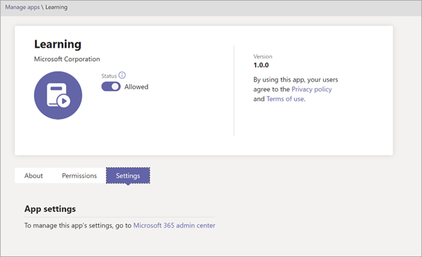
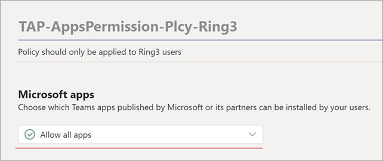
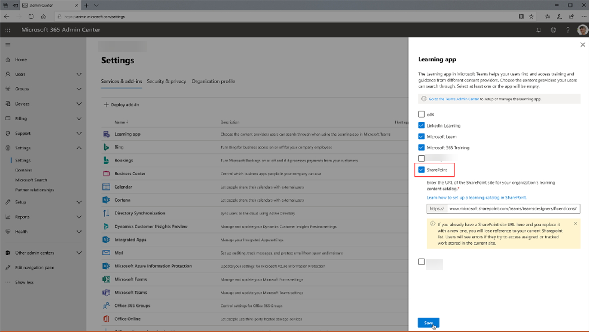
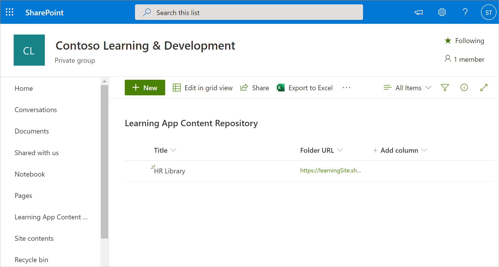

# Installieren, verwalten und Zuweisen von Berechtigungen für die Lern-App für Teams (private Preview)

*Dieser Artikel enthält vorläufige Inhalte für die Learning-App für Teams, die sich in der privaten Vorschau befindet.*

Die Microsoft Teams Learning-app (private Preview) befähigt Teams und Einzelpersonen in Ihrer Organisation, das Lernen zu einem natürlichen Teil Ihres Tages zu machen. Die App erstellt einen zentralen Hub in Teams, in dem Mitarbeiter Inhaltsbibliotheken in Ihrer Organisation freigeben, zuweisen und daraus lernen können. Administratoren setzen Berechtigungen und ermöglichen das Erlernen von Inhaltsquellen für die app. Zu den Lerninhalten können LinkedIn Learning, Microsoft Learn, Microsoft 365-Schulungen, die in SharePoint Online gespeicherten Inhalte Ihrer Organisation sowie Drittanbieter gehören, die von der App unterstützt werden.

Um die Lern-App für Teams einzurichten (private Preview), müssen Sie Folgendes einbeziehen:

-   Team Admin Center-Administrator
-   Microsoft 365 Admin Center-Administrator (also ein globaler Administrator)
-   Wissens Administrator (eine neue Rolle im Microsoft 365 Admin Center, die ein globaler Administrator (auch bekannt als IT-Administrator oder Microsoft 365-Administrator) beliebigen Personen in der Organisation zuweisen kann. Diese Rolle verwaltet die Lerninhalts Quellen der Organisation über das Microsoft 365 Admin Center.) 

## Verwalten der Lern-App für Teams (private Preview) im Team Admin Center

Der Teamadministrator installiert die Lern-App für Teams (private Preview) aus dem App Store und wendet die Richtlinien für die APP-Einrichtung,-Verwaltung und-Berechtigungen über das Team Admin Center an.

### Verwalten der Lern-App für Teams (private Preview)

Führen Sie die folgenden Schritte aus, um die Einstellungen für die APP zu verwalten:

1. Navigieren Sie in der linken Navigationsleiste des Microsoft Teams Admin Center zu **Teams apps**  >  **Verwalten von apps**.

   

2. Geben Sie auf der Seite **apps verwalten** im Suchfeld den Text *Learning* ein, um nach der Lern-App für Teams zu suchen (private Preview).

   

3. Auf der  Lernseite:
   1. Wählen Sie unter **Status** die Option **erlaubt** aus, um die APP zu aktivieren.
   2. Wechseln Sie auf der Registerkarte **Einstellungen** im Abschnitt **App-Einstellungen** zum Microsoft 365 Admin Center, um Lerninhalts Quellen zu konfigurieren.

   

4. Nachdem Sie die App-Einstellungen **verwaltet** haben, wechseln Sie zu **Berechtigungen und Einrichten von Richtlinien** , um Mitarbeitern, die Zugriff auf die APP haben sollen, als Teil der Teilnahme Ihrer Organisation an der privaten Vorschau die Berechtigung zu erteilen.

> [!NOTE]
>  Wenn sich Ihre Organisation im Rahmen des Teams TAP100-Programms in Ring 4,0 befindet, müssen Sie möglicherweise die folgenden Schritte ausführen, um zugelassene Benutzer in Ring 3,0 für den Zugriff auf die Lern-App für Teams (private Preview) zu aktivieren.

Im Rahmen der privaten Vorschau wird die Lern-App für Teams (private Preview) in Ring 3,0 veröffentlicht. Wenn sich Ihre Organisation in Ring 4,0 befindet, wird die APP nicht im App Store angezeigt. Um die APP zu testen, müssen Sie eine benutzerdefinierte Berechtigungsrichtlinie für Apps erstellen, diese so festlegen, **dass alle apps** zugelassen werden, und Sie den von 3,0 genehmigten Benutzern zuweisen.

   

## Konfigurieren von Lerninhalts Quellen im Microsoft 365 Admin Center

Die Administratoren für das Microsoft 365 Admin Center – entweder alleine oder durch Zuweisen der Rolle des Wissens Administrators zu ausgewählten Personen in Ihrer Organisation – können Einstellungen verwalten, die sich auf die Lern-App für Teams (private Preview) beziehen, und können die Lerninhalts Quellen konfigurieren.

> [!TIP]
> Der Knowledge-Administrator sollte mittelmäßig technisch sein und über vorhandene SharePoint-Administratoranmeldeinformationen verfügen, vorzugsweise eine Person, die in der Bildungs-, Lern-, Schulungs-oder Mitarbeiter Erfahrung des Unternehmens gut vertraut ist.
 
Der Administrator wählt aus, welche Lerninhalts Quellen (wie LinkedIn Learning oder SharePoint) in der app verfügbar sein sollen. Der Administrator konfiguriert dann diese Quellen, um sicherzustellen, dass der Inhalt für die Suche und Ermittlung zur Verfügung steht, und kann von den Mitarbeitern durchsucht werden, die die APP verwenden.

### Zuweisen der Rolle des Wissens Administrators [optional]

Diese Schritte müssen vom Administrator für das Microsoft 365 Admin Center ausgeführt werden.

1.  Wechseln Sie in der linken Navigationsleiste des Microsoft 365 Admin Center zu **Rollen**.

2.  Wählen Sie auf der Seite **Rollen** auf der Registerkarte **Azure AD** den Eintrag **Wissens Administrator** aus.
 
3.  Wählen Sie auf der Seite **Wissens Administrator** im Abschnitt **zugewiesene Administratoren** die Option **Hinzufügen** aus, und fügen Sie dann die für die Rolle ausgewählte Person hinzu.

### Konfigurieren von Einstellungen für die Lerninhalts Quellen für die APP

Diese Schritte müssen vom Microsoft 365-Administrator oder vom Knowledge-Administrator ausgeführt werden.

1.  Navigieren Sie in der linken Navigationsleiste des Microsoft 365 Admin Center zu **Einstellungen**  >  **org-Einstellungen**.

2.  Wählen Sie auf der Seite " **Einstellungen** " auf der Registerkarte **Dienste & Add-ins** die Option **Lern-App** aus.

   

3.  Wählen Sie im Lernprogramm- **App** -Panel die Lerninhalts Quellen aus, die Sie für die Organisation konfigurieren möchten, und wählen Sie dann **Speichern** aus.

   

Unter allen vorhandenen Lernquellen sind einige standardmäßig aktiviert. Hierzu zählen folgende Punkte:

- LinkedIn Learning (Kostenlose Inhalte)
- Microsoft Learn
- Microsoft 365-Schulung

> [!NOTE]
> Wenn Ihre Organisation über ein LinkedIn Learning Standard-oder pro-Abonnement verfügt, wird das Inhalts-Repository für die Mitarbeiter in Ihrer Organisation freigegeben. Nur Mitarbeiter, die über die Berechtigung verfügen, können das gesamte Inhalts-Repository verwenden.

Andere Quellen müssen möglicherweise manuell aktiviert oder konfiguriert werden. Lernquellen, die nicht von Microsoft stammen, sind separat zwischen Ihrer Organisation und dem Drittanbieter lizenziert. Sie müssen sicherstellen, dass Sie sich für das Lernen für Sie und Ihre Benutzer angemeldet haben.

Wenn Sie eine Lerninhalts Quelle aktivieren oder deaktivieren möchten, aktivieren Sie das Kontrollkästchen neben der Quelle. Wenn eine Quelle aktiviert ist, wird ein Häkchen angezeigt.

## Konfigurieren von SharePoint als Lerninhalts Quelle

Sie konfigurieren SharePoint als Lerninhalts Quelle für die Lern-app "Teams" (private Preview) im Microsoft 365 Admin Center.

### Übersicht

Der Knowledge-Administrator stellt eine Website-URL bereit, in der der Lerndienst ein leeres zentrales Learning Content-Repository in Form einer strukturierten SharePoint-Liste erstellen kann. Diese Liste kann von der Organisation verwendet werden, um Links zu unternehmensübergreifenden SharePoint-Ordnern mit Lerninhalten zu unterhalten. Administratoren sind für das Sammeln und kuratiert einer Liste von URLs für Ordner verantwortlich. Diese Ordner sollten nur Inhalte enthalten, die in der Lern-App für Teams zur Verfügung gestellt werden können (private Preview).

### Berechtigungen

Ordner-URLs können von jeder SharePoint-Website in der Organisation erfasst werden. Alle Inhalte in diesen Ordnern sind durchsuchbar, jedoch können nur Inhalte verwendet werden, für die der einzelne Mitarbeiter über Berechtigungen verfügt.
 
### Learning Service

Der Schulungs Dienst verwendet die bereitgestellten Ordner-URLs, um Metadaten aus allen Inhalten abzurufen, die in diesen Ordnern gespeichert sind. Innerhalb von 24 Stunden nach der Bereitstellung der Ordner-URL im zentralen Repository können die Mitarbeiter den Unternehmensinhalt in der APP suchen und verwenden. Das Löschen von Inhalten aus dem Repository wird an dieser Stelle nicht unterstützt. Unbeabsichtigt aufgetauchte Inhalte können nur entfernt werden, indem eine neue SharePoint-Website-URL im Microsoft 365 Admin Center bereitgestellt wird.

### Konfigurieren von SharePoint als Quelle

Diese Schritte müssen vom Microsoft 365-Administrator oder dem Knowledge-Administrator ausgeführt werden.

1.  Wechseln Sie in der linken Navigationsleiste des Microsoft 365 Admin Center zu **Einstellungen**.
 
2.  Wählen Sie auf der Seite " **Einstellungen** " auf der Registerkarte **Dienste & Add-ins** die Option **Lern-App** aus.

   

3.  Stellen Sie im App-Bereich für **Lernende** die Website-URL für die SharePoint-Website bereit, auf der die APP ein zentrales Repository erstellen soll.

   

4.  Eine SharePoint-Liste wird automatisch auf der SharePoint-Website der bereitgestellten Organisation erstellt. Wählen Sie in der linken Navigationsleiste der SharePoint-Website die Option **Learning App Content Repository** aus. 

   

 
5. Füllen Sie auf der Seite **Learning App Content Repository** die SharePoint-Liste mit URLs für die Lerninhalts Ordner.

   1.   Wählen Sie **neu** aus, um den Abschnitt **Neues Element** anzuzeigen. 

   
 
   2.   Fügen Sie im Bereich **Neues Element** im Feld **Titel** einen Verzeichnisnamen Ihrer Wahl hinzu. Fügen Sie im Feld **Ordner-URL** die URL zum Ordner Learning Content hinzu. Klicken Sie auf **Speichern**.

   

   3. Die Seite "Learning App Content Repository" wird mit dem neuen Lerninhalt aktualisiert.

   

 

