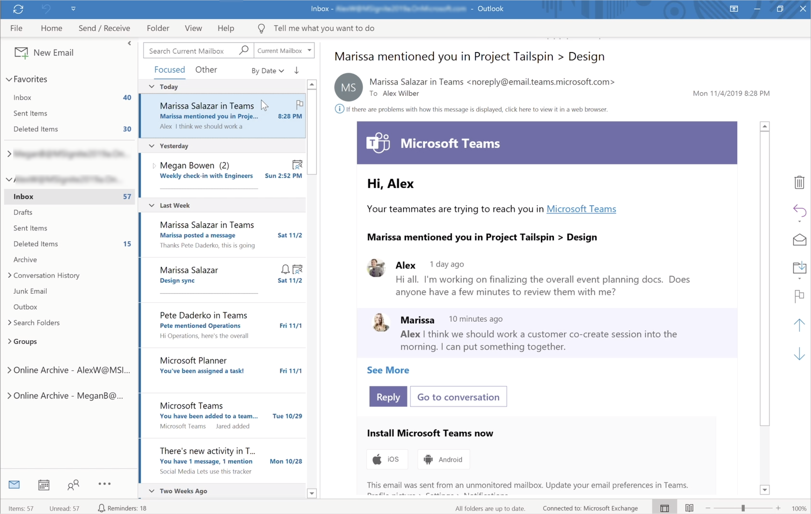
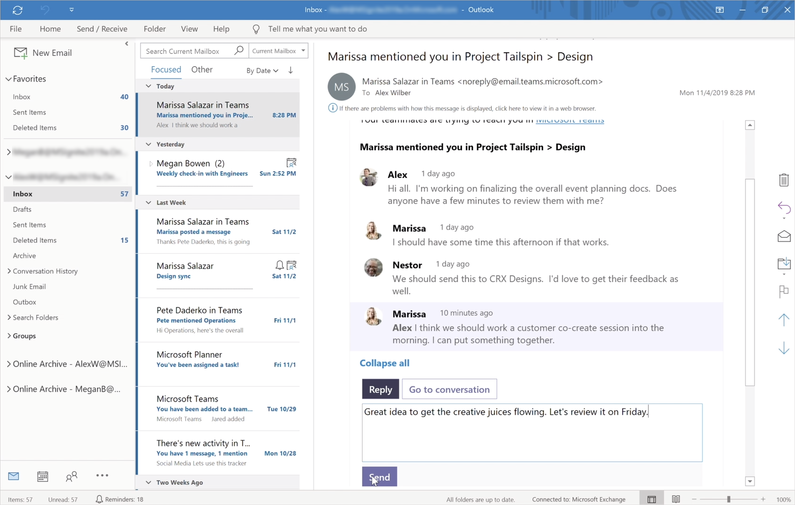

# Teams und Outlook-e-Mail-IntegrationTeams and Outlook email integration

Microsoft Teams umfasst Features, die Benutzern in Ihrer Organisation die gemeinsame Nutzung von Informationen zwischen e-Mails in Outlook und Chats oder Kanal Unterhaltungen in Teams und das übernehmen von verpassten Unterhaltungen erleichtern.Microsoft Teams includes features that make it easy for users in your organization to share information between email in Outlook and chat or channel conversations in Teams and to stay on top of missed conversations. In diesem Artikel erhalten Sie einen Überblick über diese Features und die anwendbaren Administrator Steuerelemente.This article gives you an overview of these features and the admin controls that apply.

## Freigeben für OutlookShare to Outlook

**Freigeben für Outlook** ermöglicht Benutzern das Freigeben einer Kopie einer Teams-Unterhaltung an eine e-Mail in Outlook, ohne Teams verlassen zu müssen.**Share to Outlook** lets users share a copy of a Teams conversation to an email in Outlook, without having to leave Teams. Dieses Feature ist praktisch, wenn Benutzer Konversationen oder Status Updates für Benutzer außerhalb Ihres unmittelbaren Teams oder sogar Ihrer Organisation freigeben müssen.This feature is handy if users need to share conversations or status updates with users outside their immediate team or even your organization. Wechseln Sie in Microsoft Teams zum Anfang der Unterhaltung, wählen Sie **̇ ̇ ̇ Weitere Optionen**aus, und wählen Sie dann in **Outlook freigeben**aus.Go to the top of the conversation in Teams, select **˙˙˙ More options**, and then select **Share to Outlook**.  Weitere Informationen finden Sie unter [Freigeben für Outlook aus Teams](https://support.office.com/article/share-to-outlook-from-teams-f9dabbe9-9e9b-4e35-99dd-2eeeb67c4f6d).To learn more, see [Share to Outlook from Teams](https://support.office.com/article/share-to-outlook-from-teams-f9dabbe9-9e9b-4e35-99dd-2eeeb67c4f6d).

Damit Sie dieses Feature verwenden können, muss Outlook im Web für den Benutzer aktiviert sein.To use this feature, Outlook on the web must be turned on for the user. Wenn Outlook im Web deaktiviert ist, wird die Option **für Outlook freigeben** in Teams für den Benutzer nicht angezeigt.If Outlook on the web is turned off, the **Share to Outlook** option isn't displayed in Teams for the user. Eine schrittweise Anleitung zum Aktivieren und Deaktivieren von Outlook im Web finden Sie unter [Aktivieren oder Deaktivieren von Outlook im Web für ein Postfach](https://docs.microsoft.com/exchange/recipients-in-exchange-online/manage-user-mailboxes/enable-or-disable-outlook-web-app).For steps on how to turn on and turn off Outlook on the web, see [Enable or disable Outlook on the web for a mailbox](https://docs.microsoft.com/exchange/recipients-in-exchange-online/manage-user-mailboxes/enable-or-disable-outlook-web-app).

## Transaktionale Aktivitäts-e-MailsActionable activity emails

Benutzer erhalten automatisch umsetzbare verpasste Aktivitäts-e-Mails, die Ihnen helfen, sich über verpasste Unterhaltungen in Teams zu informieren.Users automatically get actionable missed activity emails which help them to catch up on missed conversations in Teams. Die e-Mail-Benachrichtigungen über verpasste Aktivitäten zeigen die neuesten Antworten einer Unterhaltung an, einschließlich Nachrichten, die nach der verpassten Nachricht gesendet wurden, und Benutzer können auf **Antworten** klicken, um direkt in Outlook zu antworten.The missed activity emails show the latest replies from a conversation, including messages that were sent after the missed message, and users can click **Reply** to respond directly from within Outlook. Weitere Informationen finden Sie unter [Antworten auf verpasste Aktivitäts-e-Mails aus Outlook](https://support.office.com/article/reply-to-missed-activity-emails-from-outlook-bc0cf587-db26-4946-aac7-8eebd84f1381) und Umsetz fähigen [Nachrichten in Outlook-und Office 365-Gruppen](https://docs.microsoft.com/outlook/actionable-messages/).To learn more, see [Reply to missed activity emails from Outlook](https://support.office.com/article/reply-to-missed-activity-emails-from-outlook-bc0cf587-db26-4946-aac7-8eebd84f1381) and [Actionable messages in Outlook and Office 365 Groups](https://docs.microsoft.com/outlook/actionable-messages/).

Sie können das Cmdlet " [Satz-OrganizationConfig](https://docs.microsoft.com/powershell/module/exchange/organization/set-organizationconfig) " zusammen mit dem **SmtpActionableMessagesEnabled** -Parameter verwenden, um Umsetz-e-Mails zu deaktivieren.You can use the [Set-OrganizationConfig](https://docs.microsoft.com/powershell/module/exchange/organization/set-organizationconfig) cmdlet together with the **SmtpActionableMessagesEnabled** parameter to turn off actionable emails. Standardmäßig ist der **SmtpActionableMessagesEnabled** -Parameter auf **true**festgelegt.By default, the **SmtpActionableMessagesEnabled** parameter is set to **true**. Durch Festlegen des Parameters auf " **false** " werden umsetzbar e-Mail-Nachrichten in Office 365 deaktiviert.Setting the parameter to **false** turns off actionable email messages across Office 365. Für Teams-Benutzer bedeutet dies, dass die **Antwort** Option zum direkten Antworten in Outlook in verpassten Aktivitäts-e-Mails nicht zur Verfügung steht.For Teams users, this means that the **Reply** option to respond directly in Outlook isn't available in missed activity emails. Stattdessen umfassen die e-Mail-verpassten Aktivitäten eine Option **in Teams Antworten** , damit Benutzer in Teams Antworten können.Instead, the missed activity emails include a **Reply in Teams** option for users to reply in Teams.
